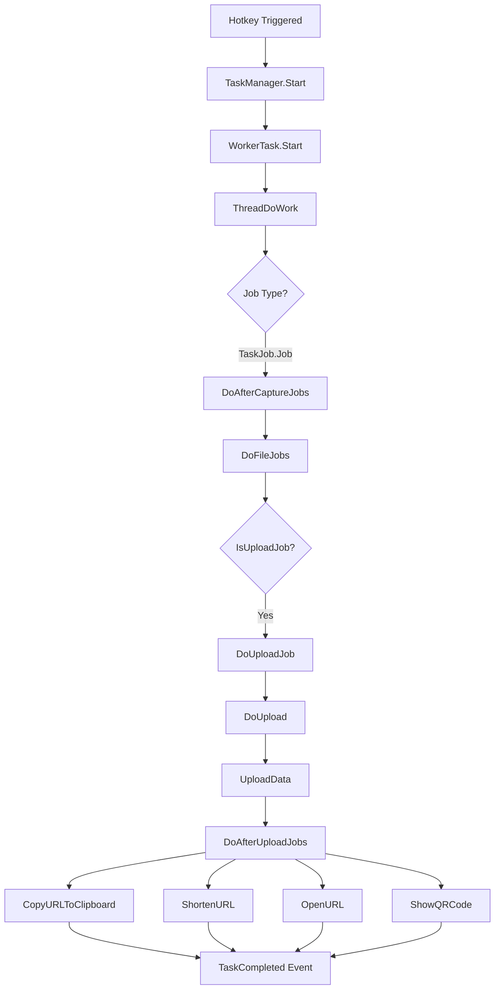

# ShareX.Avalonia - Full Automation Implementation Plan

**Date**: 2025-12-31  
**Goal**: Implement full automation from hotkey → screenshot → annotate → upload → URL to clipboard

## ShareX Automation Workflow Analysis

### Current ShareX Architecture



### Key Components

#### 1. **WorkerTask** (Core Automation Engine)
**Location**: `ShareX\ShareX\WorkerTask.cs` (1230 lines)

**Lifecycle**:
1. **Created** via factory patterns:
   - `CreateImageUploaderTask()` - For screenshots
   - `CreateFileUploaderTask()` - For existing files
   - `CreateTextUploaderTask()` - For text snippets
   - `CreateURLShortenerTask()` - For URL shortening
   
2. **Started** via `Start()` → spawns STA thread

3. **Executes** via `ThreadDoWork()`:
   ```csharp
   DoThreadJob()        // Pre-processing
   → DoAfterCaptureJobs()  // Image effects, save, annotate
   → DoFileJobs()          // External actions
   → DoUploadJob()         // Upload to service
   → DoAfterUploadJobs()   // URL processing, clipboard
   ```

4. **Completes** via `ThreadCompleted` event

#### 2. **TaskManager** (Task Orchestration)
**Location**: `ShareX\ShareX\TaskManager.cs` (552 lines)

**Responsibilities**:
- Task queue management
- Event routing (StatusChanged, UploadCompleted, TaskCompleted)
- Progress UI updates
- History persistence
- Notification system

**Key Methods**:
- `Start(WorkerTask)` - Adds task to queue, wires events
- `StartTasks()` - Respects upload limit concurrency
- Progress tracking and tray icon updates

#### 3. **DoAfterCaptureJobs** (Image Processing)
**Lines**: 572-718 in WorkerTask.cs

**Tasks** (configured via `AfterCaptureTasks` flags):
- `BeautifyImage` - Border effects
- `AddImageEffects` - Apply effects pipeline
- `AnnotateImage` - Open annotation editor (BLOCKING)
- `CopyImageToClipboard` - Copy raw image
- `SaveImageToFile` - Save to screenshots folder
- `SaveImageToFileWithDialog` - User chooses location
- `SaveThumbnailImageToFile` - Create thumbnail

**Critical**: Image is converted to stream (`PrepareImage()`) for upload

#### 4. **DoAfterUploadJobs** (Post-Upload Automation)
**Lines**: 810-897 in WorkerTask.cs

**Tasks** (configured via `AfterUploadTasks` flags):
- `UseURLShortener` - Shorten the URL
- `ShareURL` - Share via service
- **`CopyURLToClipboard`** ✅ - **THE KEY AUTOMATION**
- `OpenURL` - Open in browser
- `ShowQRCode` - Display QR code

**Clipboard Format**:
```csharp
if (!string.IsNullOrEmpty(ClipboardContentFormat))
{
    txt = new UploadInfoParser().Parse(Info, ClipboardContentFormat);
}
else
{
    txt = Info.Result.ToString(); // Default: just the URL
}
ClipboardHelpers.CopyText(txt);
```

---

## What's Missing in ShareX.Avalonia

### ❌ Not Implemented

1. **WorkerTask equivalent** - No automation engine
2. **TaskManager** - No task queue/orchestration
3. **TaskSettings** - Limited configuration
4. **AfterCaptureTasks pipeline** - Partial (annotations work, but not automated)
5. **AfterUploadTasks pipeline** - Not implemented
6. **Upload workflow** - No uploader integration
7. **UploadInfoParser** - No template system for clipboard format
8. **History persistence** - No RecentTaskManager
9. **Progress tracking** - No upload progress events
10. **Notification system** - No toast notifications

### ✅ Partially Implemented

1. **Hotkey system** - Infrastructure exists (`HotkeyManager`, `HotkeyService`)
2. **Screenshot capture** - RegionCaptureWindow works
3. **Annotation editor** - 16 tools fully functional
4. **Image effects** - 50+ effects available
5. **Upload providers** - Plugin system + Imgur/S3 ready

---

## Implementation Plan

### Phase 1: Core Task System (Foundation)

#### A. Create `ShareX.Avalonia.Core.Tasks` Namespace

**Files to create**:

1. **`WorkflowTask.cs`** (Avalonia equivalent of WorkerTask)
   ```csharp
   public class WorkflowTask : IDisposable
   {
       public event EventHandler<TaskStatusEventArgs> StatusChanged;
       public event EventHandler<UploadProgressEventArgs> UploadProgressChanged;
       public event EventHandler<TaskCompletedEventArgs> TaskCompleted;
       
       public TaskInfo Info { get; }
       public TaskStatus Status { get; private set; }
       public Stream? Data { get; private set; }
       public Bitmap? Image { get; private set; }
       
       public async Task StartAsync();
       private async Task ExecuteWorkflowAsync();
       private async Task DoAfterCaptureJobsAsync();
       private async Task DoUploadJobAsync();
       private async Task DoAfterUploadJobsAsync();
   }
   ```

2. **`TaskInfo.cs`** (Task metadata)
   ```csharp
   public class TaskInfo
   {
       public string FileName { get; set; }
       public string? FilePath { get; set; }
       public EDataType DataType { get; set; }
       public TaskJob Job { get; set; }
       public TaskSettings TaskSettings { get; }
       public UploadResult? Result { get; set; }
       public DateTime TaskStartTime { get; set; }
       public DateTime TaskEndTime { get; set; }
       public TimeSpan TaskDuration => TaskEndTime - TaskStartTime;
   }
   ```

3. **`TaskStatus.cs`** (Enums)
   ```csharp
   public enum TaskStatus
   {
       InQueue,
       Preparing,
       Working,
       Completed,
       Failed,
       Stopped,
       History
   }
   
   public enum TaskJob
   {
       Job,              // Full workflow (capture → upload)
       DataUpload,       // Upload data from stream
       FileUpload,       // Upload existing file
       TextUpload,       // Upload text
       ShortenURL,       // Just shorten URL
       ShareURL          // Just share URL
   }
   ```

4. **`TaskManager.cs`** (Orchestration)
   ```csharp
   public static class TaskManager
   {
       public static ObservableCollection<WorkflowTask> Tasks { get; }
       public static EventHandler<WorkflowTask> TaskAdded;
       public static EventHandler<WorkflowTask> TaskCompleted;
       
       public static void Start(WorkflowTask task);
       public static void Stop(WorkflowTask task);
       private static async Task StartQueuedTasksAsync();
   }
   ```

#### B. Extend `TaskSettings` with Workflow Flags

**Add to existing `TaskSettings.cs`**:
```csharp
[Flags]
public enum AfterCaptureTasks
{
    None = 0,
    AddImageEffects = 1 << 0,
    AnnotateImage = 1 << 1,
    CopyImageToClipboard = 1 << 2,
    SaveImageToFile = 1 << 3,
    SaveImageToFileWithDialog = 1 << 4,
    UploadImageToHost = 1 << 5,
    DeleteFileAfterUpload = 1 << 6
}

[Flags]
public enum AfterUploadTasks
{
    None = 0,
    CopyURLToClipboard = 1 << 0,
    OpenURL = 1 << 1,
    ShortenURL = 1 << 2,
    ShareURL = 1 << 3,
    ShowQRCode = 1 << 4,
    ShowNotification = 1 << 5
}

public class TaskSettings
{
    public AfterCaptureTasks AfterCaptureJob { get; set; } = AfterCaptureTasks.UploadImageToHost;
    public AfterUploadTasks AfterUploadJob { get; set; } = AfterUploadTasks.CopyURLToClipboard;
    
    public UploadDestinations ImageDestination { get; set; }
    public UploadDestinations FileDestination { get; set; }
    public UploadDestinations TextDestination { get; set; }
    
    public string ClipboardContentFormat { get; set; } = "%url%";
    public bool AutoClearClipboard { get; set; } = false;
}
```

---

### Phase 2: Upload Integration

#### A. Wire Upload Providers

**Modify `WorkflowTask.DoUploadJobAsync()`**:
```csharp
private async Task DoUploadJobAsync()
{
    Status = TaskStatus.Working;
    
    // Get correct uploader provider based on destination
    var instanceManager = InstanceManager.Instance;
    var providerInstance = instanceManager.GetDefaultInstance(Info.DataType);
    
    if (providerInstance == null)
    {
        Info.Result = new UploadResult { IsError = true };
        Info.Result.Errors.Add("No uploader configured");
        return;
    }
    
    // Get provider
    var provider = ProviderCatalog.Instance.GetProvider(providerInstance.ProviderKey);
    
    // Create uploader
    var uploader = provider.CreateUploader();
    uploader.ProgressChanged += (s, progress) =>
    {
        Info.Progress = progress;
        RaiseUploadProgressChanged();
    };
    
    // Upload
    Info.Result = await uploader.UploadAsync(Data, Info.FileName);
}
```

#### B. Add `UploadResult` Model

**Create `ShareX.Avalonia.Uploaders.Models\UploadResult.cs`**:
```csharp
public class UploadResult
{
    public string? URL { get; set; }
    public string? ThumbnailURL { get; set; }
    public string? DeletionURL { get; set; }
    public string? ShortenedURL { get; set; }
    public bool IsError { get; set; }
    public UploaderErrorManager Errors { get; } = new();
    public bool IsURLExpected { get; set; } = true;
    
    public override string ToString()
    {
        return ShortenedURL ?? URL ?? ThumbnailURL ?? string.Empty;
    }
}
```

---

### Phase 3: After-Upload Automation

#### A. Implement `DoAfterUploadJobsAsync()`

```csharp
private async Task DoAfterUploadJobsAsync()
{
    if (Info.Result == null || string.IsNullOrEmpty(Info.Result.URL))
        return;
    
    var settings = Info.TaskSettings;
    
    // URL Shortener
    if (settings.AfterUploadJob.HasFlag(AfterUploadTasks.ShortenURL))
    {
        var shortener = GetURLShortener(settings.URLShortenerDestination);
        var result = await shortener.ShortenURLAsync(Info.Result.URL);
        if (result != null)
            Info.Result.ShortenedURL = result.ShortenedURL;
    }
    
    // Copy to Clipboard
    if (settings.AfterUploadJob.HasFlag(AfterUploadTasks.CopyURLToClipboard))
    {
        string clipboardText = ParseClipboardFormat(Info, settings.ClipboardContentFormat);
        await Dispatcher.UIThread.InvokeAsync(() =>
        {
            PlatformServices.Clipboard.SetText(clipboardText);
        });
    }
    
    // Open URL
    if (settings.AfterUploadJob.HasFlag(AfterUploadTasks.OpenURL))
    {
        Process.Start(new ProcessStartInfo
        {
            FileName = Info.Result.ToString(),
            UseShellExecute = true
        });
    }
    
    // Show Notification
    if (settings.AfterUploadJob.HasFlag(AfterUploadTasks.ShowNotification))
    {
        ShowNotification(Info.Result.ToString());
    }
}
```

#### B. Add `UploadInfoParser`

**Create `ShareX.Avalonia.Core.Helpers\UploadInfoParser.cs`**:
```csharp
public class UploadInfoParser
{
    public string Parse(TaskInfo info, string format)
    {
        if (string.IsNullOrEmpty(format))
            return info.Result?.ToString() ?? string.Empty;
        
        return format
            .Replace("%url%", info.Result?.URL ?? "")
            .Replace("%shorturl%", info.Result?.ShortenedURL ?? "")
            .Replace("%thumbnail%", info.Result?.ThumbnailURL ?? "")
            .Replace("%deletionurl%", info.Result?.DeletionURL ?? "")
            .Replace("%filename%", info.FileName ?? "")
            .Replace("%filepath%", info.FilePath ?? "")
            .Replace("%time%", DateTime.Now.ToString("yyyy-MM-dd HH:mm:ss"));
    }
}
```

---

### Phase 4: Hotkey Integration

#### A. Connect Hotkey to Workflow

**Modify `HotkeyService.cs`**:
```csharp
private async void OnHotkeyPressed(object? sender, HotkeyEventArgs e)
{
    if (e.Hotkey.Task == HotkeyTask.RegionCapture)
    {
        // Create workflow task
        var task = WorkflowTask.CreateImageCaptureTask(
            captureMode: CaptureMode.Region,
            taskSettings: GetTaskSettings(e.Hotkey)
        );
        
        // Start automation
        TaskManager.Start(task);
        await task.WaitForCompletionAsync();
    }
}

private TaskSettings GetTaskSettings(Hotkey hotkey)
{
    // Load from settings or use defaults
    var primary = _settingsManager.Settings.DefaultTaskSettings ?? new TaskSettings();
    
    // If hotkey has override settings, use those
    if (hotkey.TaskSettings != null)
        return hotkey.TaskSettings;
    
    return primary;
}
```

#### B. Update `WorkflowTask.CreateImageCaptureTask()`

```csharp
public static WorkflowTask CreateImageCaptureTask(
    CaptureMode captureMode,
    TaskSettings taskSettings)
{
    var task = new WorkflowTask(taskSettings);
    task.Info.Job = TaskJob.Job;
    task.Info.DataType = EDataType.Image;
    task.Info.FileName = TaskHelpers.GetFileName(taskSettings, "png");
    task.CaptureMode = captureMode;
    return task;
}
```

---

### Phase 5: UI Integration

#### A. Add Progress Indicator

**Add to `MainViewModel.cs`**:
```csharp
[ObservableProperty]
private bool _isUploading;

[ObservableProperty]
private double _uploadProgress;

[ObservableProperty]
private string _uploadStatus = string.Empty;

public void OnTaskProgressChanged(object? sender, UploadProgressEventArgs e)
{
    IsUploading = true;
    UploadProgress = e.Percentage;
    UploadStatus = $"Uploading... {e.Percentage:0}%";
}
```

#### B. Add Notification Service

**Create `ShareX.Avalonia.UI.Services\NotificationService.cs`**:
```csharp
public class NotificationService
{
    public void ShowToast(string title, string message, string? url = null)
    {
        // Use Avalonia notification or OS notification
        var notification = new WindowNotificationManager(
            TopLevel.GetTopLevel(App.MainWindow))
        {
            Position = NotificationPosition.BottomRight,
            MaxItems = 3
        };
        
        notification.Show(new Notification(title, message, NotificationType.Success));
    }
}
```

---

## File Structure

```
ShareX.Avalonia.Core/
├── Tasks/
│   ├── WorkflowTask.cs          (NEW - 500 LOC)
│   ├── TaskInfo.cs              (NEW - 100 LOC)
│   ├── TaskManager.cs           (NEW - 200 LOC)
│   ├── TaskStatus.cs            (NEW - 50 LOC)
│   └── UploadProgress.cs        (NEW - 30 LOC)
├── Helpers/
│   ├── UploadInfoParser.cs      (NEW - 80 LOC)
│   └── TaskHelpers.cs           (EXTEND - add GetFileName)
└── Settings/
    └── TaskSettings.cs          (EXTEND - add AfterCapture/AfterUpload flags)

ShareX.Avalonia.Uploaders/
├── Models/
│   ├── UploadResult.cs          (NEW - 60 LOC)
│   └── UploaderErrorManager.cs  (NEW - 40 LOC)
└── Abstractions/
    └── IUploaderProvider.cs     (EXTEND - add UploadAsync)

ShareX.Avalonia.UI/
├── Services/
│   └── NotificationService.cs   (NEW - 100 LOC)
└── ViewModels/
    └── MainViewModel.cs         (EXTEND - add progress properties)
```

**Total New Code**: ~1,200 LOC  
**Effort Est**: 8-12 hours

---

## Testing Plan

1. **Unit Tests**:
   - `WorkflowTask` state transitions
   - `UploadInfoParser` template parsing
   - `TaskManager` queue management

2. **Integration Tests**:
   - Hotkey → Capture → Annotate → Upload → Clipboard
   - Multiple concurrent uploads
   - Cancel mid-upload
   - Error handling (no internet, invalid config)

3. **Manual Testing**:
   - Capture → immediate upload (no annotation)
   - Capture → annotate → upload
   - Copy image only (no upload)
   - Custom clipboard format (`%url% - %filename%`)

---

## Implementation Order (Recommended)

1. **Day 1**: Core task system (WorkflowTask, TaskInfo, TaskManager)
2. **Day 2**: Upload integration (wire providers, UploadResult)
3. **Day 3**: After-upload automation (clipboard, notifications)
4. **Day 4**: Hotkey integration + UI progress
5. **Day 5**: Testing + polish

---

## Success Criteria

✅ Hotkey triggers full automation  
✅ Screenshot captured and annotated  
✅ Image uploaded to configured provider  
✅ URL copied to clipboard automatically  
✅ Toast notification shown  
✅ Progress indicator during upload  
✅ Error handling (no internet, failed upload)  
✅ Task history persisted  

---

## Known Blockers

1. **Annotation blocks workflow**: ShareX's `AnnotateImage()` is BLOCKING (modal). Need non-blocking approach or separate workflow path.
   - **Solution A**: Skip annotation in automated flow (add flag `SkipAnnotation`)
   - **Solution B**: Annotation is "editor mode" separate from "quick capture+upload"

2. **No async in original ShareX**: WorkerTask uses threads, we should use async/await
   
3. **Upload provider interface**: Need to add `UploadAsync` method to all providers

---

## Conclusion

ShareX's automation is highly sophisticated with:
- Async task queue with concurrency control
- Flexible flag-based workflow configuration
- Comprehensive error handling
- Progress tracking
- History persistence
  
ShareX.Avalonia needs **~1,200 LOC** across 12 new files to achieve feature parity.

**Recommended**: Start with Phase 1 (Core Task System) to establish foundation, then incrementally add upload and after-upload automation.
