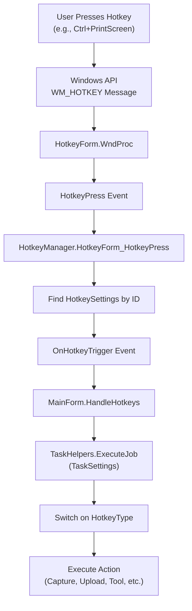
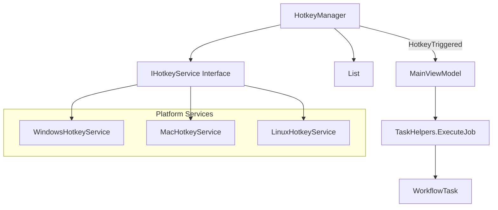

# ShareX.Avalonia Hotkey System Implementation Plan

**Created**: 2025-12-31  
**Status**: Planning  
**Priority**: High (Core functionality needed for automation workflow)

---

## Executive Summary

This document analyzes the ShareX hotkey system and provides a comprehensive implementation plan for ShareX.Avalonia. The goal is to enable global hotkey registration and execution that integrates with the existing WorkflowTask automation.

---

## Part 1: ShareX Hotkey System Analysis

### Architecture Overview



### Key Components

#### 1. HotkeyForm (ShareX.HelpersLib/Input/HotkeyForm.cs)

**Purpose**: Low-level Windows API wrapper for global hotkey registration.

**Key Features**:
- Extends `Form` to receive WM_HOTKEY messages
- Uses `RegisterHotKey`/`UnregisterHotKey` Windows APIs
- Manages hotkey repeat rate limiting
- Fires `HotkeyPress` event with ID, key, and modifiers

```csharp
// Registration flow
public void RegisterHotkey(HotkeyInfo hotkeyInfo)
{
    // 1. Generate unique atom ID via GlobalAddAtom
    hotkeyInfo.ID = NativeMethods.GlobalAddAtom(uniqueID);
    
    // 2. Register with Windows
    NativeMethods.RegisterHotKey(Handle, hotkeyInfo.ID, modifiers, keyCode);
}

// WndProc intercepts WM_HOTKEY
protected override void WndProc(ref Message m)
{
    if (m.Msg == WM_HOTKEY)
    {
        HotkeyPress?.Invoke(id, key, modifier);
    }
}
```

#### 2. HotkeyInfo (ShareX.HelpersLib/Input/HotkeyInfo.cs)

**Purpose**: Represents a single key binding.

**Properties**:
- `Keys Hotkey` - Combined key + modifiers (e.g., `Keys.Control | Keys.PrintScreen`)
- `ushort ID` - Windows API registration ID
- `HotkeyStatus Status` - Registered/NotConfigured/Failed
- Computed: `KeyCode`, `ModifiersKeys`, `Control`, `Shift`, `Alt`, `Win`

#### 3. HotkeySettings (ShareX/HotkeySettings.cs)

**Purpose**: Links a hotkey binding to task settings.

**Properties**:
- `HotkeyInfo HotkeyInfo` - The key binding
- `TaskSettings TaskSettings` - What to do when triggered (includes `Job` = HotkeyType)

#### 4. HotkeyManager (ShareX/HotkeyManager.cs)

**Purpose**: High-level orchestration of hotkey registration/triggering.

**Responsibilities**:
- Manages `List<HotkeySettings>`
- Registers/unregisters all hotkeys
- Handles toggling hotkeys on/off
- Routes hotkey triggers to subscribers

**Key Methods**:
```csharp
void UpdateHotkeys(List<HotkeySettings> hotkeys, bool showFailedHotkeys)
void RegisterHotkey(HotkeySettings hotkeySetting)
void UnregisterHotkey(HotkeySettings hotkeySetting)
void ToggleHotkeys(bool hotkeysDisabled)
static List<HotkeySettings> GetDefaultHotkeyList()
```

#### 5. TaskHelpers.ExecuteJob (ShareX/TaskHelpers.cs)

**Purpose**: Massive switch statement (60+ cases) that executes the action.

**Categories**:
- **Upload**: FileUpload, ClipboardUpload, ShortenURL, etc.
- **Screen Capture**: PrintScreen, ActiveWindow, RectangleRegion, etc.
- **Screen Record**: ScreenRecorder, ScreenRecorderGIF, etc.
- **Tools**: ColorPicker, Ruler, ImageEditor, OCR, QRCode, etc.
- **Other**: DisableHotkeys, OpenMainWindow, OpenHistory, etc.

---

## Part 2: ShareX.Avalonia Implementation Plan

### Architecture Differences

| Aspect | ShareX (WinForms) | ShareX.Avalonia |
|--------|-------------------|-----------------|
| UI Framework | WinForms | Avalonia |
| Message Loop | Form.WndProc | Platform-specific service |
| Cross-Platform | Windows only | Windows, macOS, Linux |
| Hotkey API | Windows RegisterHotKey | Platform-abstracted |

### Proposed Architecture



### Implementation Phases

#### Phase 1: Platform Abstraction (2-3 hours)

**Create interface in Platform.Abstractions**:

```csharp
// File: ShareX.Avalonia.Platform.Abstractions/Services/IHotkeyService.cs
public interface IHotkeyService
{
    event EventHandler<HotkeyTriggeredEventArgs> HotkeyTriggered;
    
    bool RegisterHotkey(HotkeyInfo hotkeyInfo);
    bool UnregisterHotkey(HotkeyInfo hotkeyInfo);
    void UnregisterAll();
    
    bool IsHotkeyRegistered(HotkeyInfo hotkeyInfo);
}

public class HotkeyTriggeredEventArgs : EventArgs
{
    public ushort HotkeyId { get; set; }
    public KeyModifiers Modifiers { get; set; }
    public Key Key { get; set; }
}
```

**Files to create**:
- [NEW] `Platform.Abstractions/Services/IHotkeyService.cs`
- [NEW] `Platform.Abstractions/Models/HotkeyInfo.cs` (Avalonia-compatible)

#### Phase 2: Windows Implementation (3-4 hours)

**P/Invoke wrapper for Windows hotkey API**:

```csharp
// File: ShareX.Avalonia.Platform.Windows/WindowsHotkeyService.cs
public class WindowsHotkeyService : IHotkeyService, IDisposable
{
    private readonly HwndSource _hwndSource;
    private readonly Dictionary<ushort, HotkeyInfo> _registeredHotkeys;
    
    // P/Invoke declarations
    [DllImport("user32.dll")]
    private static extern bool RegisterHotKey(IntPtr hWnd, int id, uint fsModifiers, uint vk);
    
    [DllImport("user32.dll")]
    private static extern bool UnregisterHotKey(IntPtr hWnd, int id);
    
    // Hook into window message loop
    private IntPtr HwndHook(IntPtr hwnd, int msg, IntPtr wParam, IntPtr lParam, ref bool handled)
    {
        if (msg == WM_HOTKEY)
        {
            // Parse and fire event
        }
    }
}
```

**Key challenges**:
- Need a window handle for hotkey registration
- Avalonia's message loop is different from WinForms
- Solution: Create invisible Win32 window or use `HwndSource`

**Files to create**:
- [NEW] `Platform.Windows/Services/WindowsHotkeyService.cs`
- [MODIFY] `Platform.Windows/PlatformServicesWindows.cs` - Register service

#### Phase 3: Core Hotkey Management (2-3 hours)

**Port HotkeyManager to Core**:

```csharp
// File: ShareX.Avalonia.Core/Hotkeys/HotkeyManager.cs
public class HotkeyManager
{
    private readonly IHotkeyService _hotkeyService;
    public List<HotkeySettings> Hotkeys { get; private set; }
    
    public event EventHandler<HotkeySettings> HotkeyTriggered;
    
    public void UpdateHotkeys(List<HotkeySettings> hotkeys) { }
    public void RegisterAllHotkeys() { }
    public void ToggleHotkeys(bool disabled) { }
    public static List<HotkeySettings> GetDefaultHotkeyList() { }
}

// File: ShareX.Avalonia.Core/Hotkeys/HotkeySettings.cs
public class HotkeySettings
{
    public HotkeyInfo HotkeyInfo { get; set; }
    public HotkeyType Job { get; set; }
    public TaskSettings TaskSettings { get; set; }
}

// File: ShareX.Avalonia.Core/Hotkeys/HotkeyType.cs (enum)
public enum HotkeyType
{
    None,
    // Screen Capture
    PrintScreen,
    ActiveWindow,
    RectangleRegion,
    // ... (60+ types from ShareX)
}
```

**Files to create**:
- [NEW] `Core/Hotkeys/HotkeyManager.cs`
- [NEW] `Core/Hotkeys/HotkeySettings.cs`
- [NEW] `Core/Hotkeys/HotkeyType.cs`
- [NEW] `Core/Hotkeys/HotkeyConfig.cs` (persistence)

#### Phase 4: TaskHelpers Integration (4-5 hours)

**Port ExecuteJob with reduced scope**:

```csharp
// File: ShareX.Avalonia.Core/Helpers/TaskHelpers.ExecuteJob.cs
public static partial class TaskHelpers
{
    public static async Task ExecuteJob(HotkeyType job, TaskSettings taskSettings)
    {
        switch (job)
        {
            // Phase 1: Core capture (MVP)
            case HotkeyType.RectangleRegion:
                await CaptureRegion(taskSettings);
                break;
            case HotkeyType.PrintScreen:
                await CaptureFullscreen(taskSettings);
                break;
            case HotkeyType.ActiveWindow:
                await CaptureActiveWindow(taskSettings);
                break;
                
            // Phase 2: Tools
            case HotkeyType.ColorPicker:
                // ... 
                break;
                
            // Phase 3: Upload (uses WorkflowTask)
            case HotkeyType.ClipboardUpload:
                await UploadClipboard(taskSettings);
                break;
        }
    }
}
```

**Files to create/modify**:
- [NEW] `Core/Helpers/TaskHelpers.ExecuteJob.cs`
- [MODIFY] `Core/Helpers/TaskHelpers.cs` - Add capture methods

#### Phase 5: UI Integration (2-3 hours)

**Hotkey configuration UI**:

```csharp
// ViewModel for hotkey settings
public class HotkeySettingsViewModel : ViewModelBase
{
    public ObservableCollection<HotkeySettingItemViewModel> Hotkeys { get; }
    public ICommand AddHotkeyCommand { get; }
    public ICommand ResetToDefaultsCommand { get; }
}
```

**Files to create**:
- [NEW] `UI/ViewModels/HotkeySettingsViewModel.cs`
- [NEW] `UI/Views/HotkeySettingsView.axaml`
- [NEW] `UI/Controls/HotkeySelector.axaml` (key capture control)

---

## Part 3: Cross-Platform Considerations

### Windows
- Use `RegisterHotKey`/`UnregisterHotKey` (same as ShareX)
- Requires window handle (HWND)
- Full modifier support (Ctrl, Alt, Shift, Win)

### macOS
- Use `CGEventTap` or `addGlobalMonitorForEvents`
- Requires accessibility permissions
- Carbon APIs deprecated but still functional

### Linux (X11)
- Use `XGrabKey` / `XUngrabKey`
- Requires X11 connection
- May need special handling for Wayland

### Recommended Approach
- **MVP**: Windows only (Phase 1-5)
- **Future**: Add macOS/Linux using platform-specific implementations

---

## Part 4: Priority Implementation Order

### MVP (Minimum Viable Product)
1. ✅ WorkflowTask automation (COMPLETE)
2. WindowsHotkeyService for registration
3. HotkeyManager core logic  
4. 3-5 essential hotkeys:
   - `Ctrl+PrintScreen` → RectangleRegion
   - `PrintScreen` → FullScreen
   - `Alt+PrintScreen` → ActiveWindow

### Phase 2
5. TaskHelpers.ExecuteJob (subset of actions)
6. Hotkey settings UI
7. Hotkey persistence

### Phase 3
8. Full HotkeyType enum support
9. Custom hotkey workflows
10. macOS/Linux support

---

## Part 5: File Summary

### New Files (12)

| File | Purpose |
|------|---------|
| `Platform.Abstractions/Services/IHotkeyService.cs` | Platform interface |
| `Platform.Abstractions/Models/HotkeyInfo.cs` | Key binding model |
| `Platform.Windows/Services/WindowsHotkeyService.cs` | Windows P/Invoke |
| `Core/Hotkeys/HotkeyManager.cs` | Registration orchestration |
| `Core/Hotkeys/HotkeySettings.cs` | Binding + action config |
| `Core/Hotkeys/HotkeyType.cs` | Action enum (60+ types) |
| `Core/Hotkeys/HotkeyConfig.cs` | Persistence model |
| `Core/Helpers/TaskHelpers.ExecuteJob.cs` | Action dispatcher |
| `UI/ViewModels/HotkeySettingsViewModel.cs` | Settings UI logic |
| `UI/Views/HotkeySettingsView.axaml` | Settings UI |
| `UI/Controls/HotkeySelector.axaml` | Key capture control |
| `UI/Controls/HotkeySelector.axaml.cs` | Key capture logic |

### Modified Files (3)

| File | Changes |
|------|---------|
| `Platform.Windows/PlatformServicesWindows.cs` | Register IHotkeyService |
| `Core/Helpers/TaskHelpers.cs` | Add capture trigger methods |
| `UI/App.axaml.cs` | Initialize HotkeyManager on startup |

---

## Part 6: Estimated Effort

| Phase | Hours | Dependencies |
|-------|-------|--------------|
- **Phase 1: Platform Abstraction** (Estimated: 2h) - **Status: COMPLETE**
- **Phase 2: Windows Implementation** (Estimated: 4h) - **Status: COMPLETE**
- **Phase 3: Core Hotkey Management** (Estimated: 3h) - **Status: COMPLETE**
- **Phase 4: TaskHelpers Integration** (Estimated: 2h) - **Status: COMPLETE**
- **Phase 5: UI Integration** (Estimated: 4h) - **Status: COMPLETE**
| **Total** | **13-18h** | |

---

## Part 7: Technical Risks

1. **Avalonia Window Handle**: Getting HWND from Avalonia window for RegisterHotKey
   - Mitigation: Use `Win32Properties.GetWin32WindowHandle()` or invisible message-only window

2. **Message Loop Integration**: WM_HOTKEY interception in Avalonia
   - Mitigation: Use `Win32Properties` or low-level hook

3. **Cross-Platform Keyboard Mapping**: Avalonia `Key` vs Windows `VK_*`
   - Mitigation: Create key code conversion utilities

4. **Editor Mode Conflict**: Global hotkeys active while in annotation editor
   - Mitigation: IgnoreHotkeys flag during editor focus

---

## Appendix: ShareX Default Hotkeys

```csharp
// From HotkeyManager.GetDefaultHotkeyList()
new HotkeySettings(HotkeyType.RectangleRegion, Keys.Control | Keys.PrintScreen)
new HotkeySettings(HotkeyType.PrintScreen, Keys.PrintScreen)
new HotkeySettings(HotkeyType.ActiveWindow, Keys.Alt | Keys.PrintScreen)
new HotkeySettings(HotkeyType.ScreenRecorder, Keys.Shift | Keys.PrintScreen)
new HotkeySettings(HotkeyType.ScreenRecorderGIF, Keys.Control | Keys.Shift | Keys.PrintScreen)
```

---

## Next Steps

1. **Review this plan** and approve architecture
2. **Start Phase 1**: Create `IHotkeyService` interface
3. **Continue Phase 2**: Implement `WindowsHotkeyService` with P/Invoke
4. **Test MVP**: Register one hotkey, trigger capture, verify workflow
