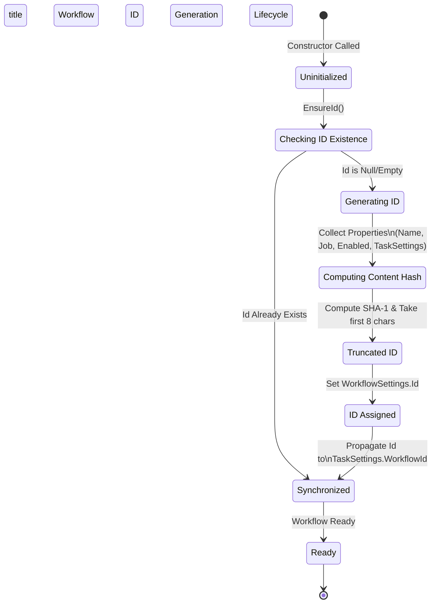

# Workflow ID Generation Analysis

This document analyzes the logic behind the `WorkflowSettings.Id` generation, specifically focusing on the deterministic creation of IDs using SHA-1 hashing of workflow properties.

## The "Novel Idea": Deterministic Content-Based Identity

The core concept is that a Workflow's Identity (`Id`) is intrinsic to its configuration at the moment of creation. Instead of assigning a random Guid or an auto-incrementing integer, the system generates an ID by hashing the defining characteristics of the workflow.

**Key Characteristics:**
*   **Deterministic:** The same configuration (Name, Job, Enabled status, etc.) produces the same ID.
*   **Immutable (Effectively):** The ID is generated once upon initialization (`EnsureId`) and is not automatically regenerated when properties change, acting as a "birth certificate" of the workflow's initial state.
*   **Shortened:** The full SHA-1 hash is truncated to the first 8 characters for brevity, similar to Git commit short hashes.

## State Machine Diagram

The following Mermaid diagram illustrates the lifecycle of the `WorkflowSettings.Id`.



## Logic Breakdown

1.  **Trigger:** The process is triggered via the `EnsureId()` method, which is called immediately within the `WorkflowSettings` constructors.
2.  **Generation (`GenerateId`):**
    *   A string is constructed combining: `Name`, `Job` type, `Enabled` status, `TaskSettings.Job`, and `TaskSettings.Description`.
    *   SHA-1 hash of this string is computed.
    *   The hash is converted to a hex string and truncated to 8 characters.
3.  **Synchronization:** The generated `Id` is immediately copied to `TaskSettings.WorkflowId` to ensure the task configuration is aware of its parent workflow's identity.

## Code Reference

**File:** `src\ShareX.Avalonia.Core\Hotkeys\HotkeySettings.cs`

```csharp
public string GenerateId()
{
    using var sha1 = System.Security.Cryptography.SHA1.Create();

    // Create a unique string representation of the workflow
    var workflowString = $"{Name ?? string.Empty}|{Job}|{Enabled}|
        {TaskSettings?.Job}|{TaskSettings?.Description ?? string.Empty}";

    var hash = sha1.ComputeHash(System.Text.Encoding.UTF8.GetBytes(workflowString));
    return BitConverter.ToString(hash).Replace("-", "").ToLowerInvariant().Substring(0, 8);
}
```
