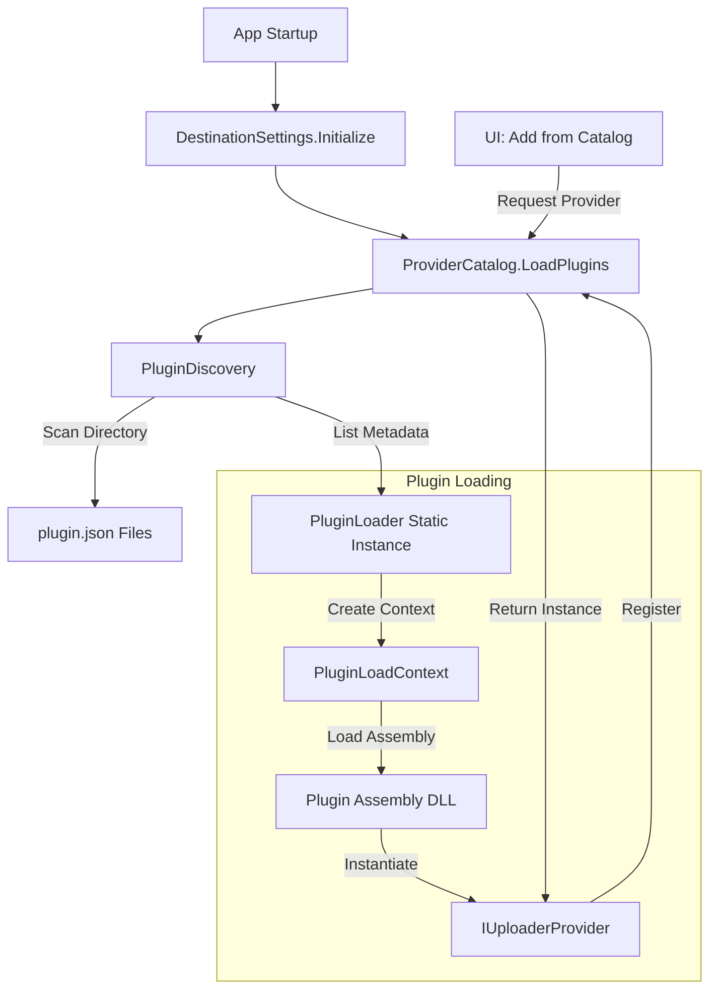

# Plugin System Implementation Plan

**Status**: ✅ Implemented (Pure Dynamic Loading)
**Namespace**: `ShareX.Avalonia.Uploaders.PluginSystem`

## 1. Objective
Create a modular, extensible plugin system for ShareX.Avalonia that allows adding new uploader providers (and potentially other components) without modifying the core application. The system must support dynamic loading, versioning, and isolation of dependencies using **pure dynamic loading** with no compile-time coupling to plugin assemblies.

## 2. Architecture Overview

### Current Implementation: Pure Dynamic Loading

```
┌─────────────────────────────────────────┐
│ ShareX.Avalonia.App                     │
│  ├─ References: ShareX.Avalonia.UI      │
│  └─ NO plugin references                │
└─────────────────────────────────────────┘
              │
              ▼
┌─────────────────────────────────────────┐
│ ShareX.Avalonia.UI                      │
│  ├─ References: ShareX.Avalonia.Uploaders│
│  └─ NO plugin references                │
│  ├─ ProviderCatalog.LoadPlugins()       │
│  └─ Uses plugins via IUploaderProvider  │
└─────────────────────────────────────────┘
              │
              ▼
┌─────────────────────────────────────────┐
│ ShareX.Avalonia.Uploaders (Contracts)   │
│  ├─ IUploaderProvider interface         │
│  ├─ UploaderInstance                    │
│  └─ PluginLoadContext                   │
└─────────────────────────────────────────┘
              ▲
              │ (referenced by)
              │
    ┌─────────┴──────────┐
    │                    │
┌───┴────────────┐  ┌───┴────────────┐
│ Imgur Plugin   │  │ Amazon S3      │
│ (Dynamic Load) │  │ (Dynamic Load) │
└────────────────┘  └────────────────┘
```

### Plugin Loading Flow



## 3. Core Components

### A. Core Interfaces
*   **`IUploaderPlugin`**: The base interface that all plugins must implement. Defines metadata (Id, Name, Version) and lifecycle methods.
*   **`IUploaderProvider`**: Specialized interface for uploader plugins. Handles configuration and uploader instance creation.

### B. System Components

#### 1. **`ProviderCatalog`** (`ProviderCatalog.cs`)
*   **Role**: Central registry and entry point.
*   **Function**: Orchestrates discovery and loading. Maintains a thread-safe dictionary of available providers.
*   **API**: `GetProvider(id)`, `GetAllProviders()`, `LoadPlugins(path)`.
*   **Key Implementation**: Maintains a **static `PluginLoader`** instance to prevent garbage collection of plugin contexts.

#### 2. **`PluginDiscovery`** (`PluginDiscovery.cs`)
*   **Role**: Scanner and Validator.
*   **Function**: Scans a specific directory (recursive) for `plugin.json` manifest files.
*   **Validation**: Checks API version compatibility and manifest integrity before attempting to load code.

#### 3. **`PluginLoader`** (`PluginLoader.cs`)
*   **Role**: Assembly Loader.
*   **Function**: Loads plugin assemblies into isolated `PluginLoadContext` (ALC) to prevent dependency conflicts between plugins.
*   **Instantiation**: Uses reflection to find the entry point defined in `plugin.json` and creates the provider instance.
*   **Lifetime**: **CRITICAL** - Stored as static field in `ProviderCatalog` to keep load contexts alive and prevent GC.

#### 4. **`PluginLoadContext`** (`PluginLoadContext.cs`)
*   **Role**: Runtime Isolation.
*   **Technique**: Inherits from `.NET AssemblyLoadContext`.
*   **Benefit**: Allows plugins to use different versions of the same library without crashing the main app.
*   **Shared Dependencies**: Explicitly returns `null` for framework and shared assemblies, forcing them to load from the host:
    - `ShareX.Ava.Uploaders` (contract)
    - `ShareX.Ava.Common`
    - `Newtonsoft.Json`
    - `CommunityToolkit.Mvvm`
    - `Avalonia.*` (all framework assemblies)
    - `System.*`, `Microsoft.*`

## 4. Plugin Structure

A valid plugin consists of a folder containing at least two files:

### 1. **`plugin.json`** (Manifest)
```json
{
  "pluginId": "imgur",
  "name": "Imgur Uploader",
  "version": "1.0.0",
  "apiVersion": "1.0",
  "assembly": "ShareX.Imgur.Plugin.dll",
  "entryPoint": "ShareX.Imgur.Plugin.ImgurProvider",
  "description": "Upload images to Imgur anonymously or with account."
}
```

### 2. **`ShareX.Imgur.Plugin.dll`** (Assembly)
*   Must reference `ShareX.Avalonia.Uploaders` (for interfaces) with `<Private>false</Private>`.
*   Must contain a class implementing `IUploaderProvider` matching the `entryPoint`.
*   Can include dependencies (other DLLs) which are copied via post-build.

### 3. Plugin Project Configuration

Plugins use special `.csproj` settings to enable dynamic loading:

```xml
<PropertyGroup>
  <CopyLocalLockFileAssemblies>true</CopyLocalLockFileAssemblies>
  <EnableDynamicLoading>true</EnableDynamicLoading>
</PropertyGroup>

<!-- Shared dependencies from host - don't copy -->
<ProjectReference Include="..\..\ShareX.Avalonia.Uploaders\...">
  <Private>false</Private>
  <ExcludeAssets>runtime</ExcludeAssets>
</ProjectReference>

<!-- Post-build copy to Plugins directory -->
<Target Name="CopyToPluginsDir" AfterTargets="Build">
  <PropertyGroup>
    <PluginOutputDir>$(MSBuildThisFileDirectory)..\..\ShareX.Avalonia.App\bin\$(Configuration)\net10.0-windows\Plugins\$(PluginId)</PluginOutputDir>
  </PropertyGroup>
  <ItemGroup>
    <PluginFiles Include="$(OutputPath)**\*.*" Exclude="$(OutputPath)**\*.pdb;$(OutputPath)**\*.deps.json" />
  </ItemGroup>
  <MakeDir Directories="$(PluginOutputDir)" Condition="!Exists('$(PluginOutputDir)')" />
  <Copy SourceFiles="@(PluginFiles)" DestinationFolder="$(PluginOutputDir)\%(RecursiveDir)" SkipUnchangedFiles="true" />
</Target>
```

## 5. Implementation Details

### Discovery Process
1. System looks for `Plugins/` directory in app base directory.
2. Iterates all subdirectories.
3. Parses `plugin.json` in each subdirectory.
4. Validates `apiVersion` matches host application.

### Loading Process
1. `PluginLoader` (static instance) creates a new `PluginLoadContext` for the plugin path.
2. Loads the assembly specified in `assembly` field.
3. Scans exported types to find the `entryPoint`.
4. Verifies the type implements `IUploaderProvider`.
5. Instantiates the type via `Activator.CreateInstance`.
6. Stores the `PluginLoadContext` in `_loadedContexts` dictionary to prevent GC.
7. Registers the provider instance in `ProviderCatalog`.

### Dependencies
*   Plugins can ship their own dependencies (DLLs) in their folder.
*   `PluginLoadContext` resolves dependencies from the plugin folder first.
*   Shared types (like `IUploaderProvider`) are loaded from the Host Context via `IsSharedDependency()` check to ensure type compatibility.

### UI Component Handling

Plugins expose UI views through the `IUploaderProvider` interface:

```csharp
Control? GetConfigView(UploaderInstance instance);
```

The plugin compiles its XAML into the plugin assembly. At runtime, the host calls `GetConfigView()` which returns an Avalonia `Control` (typically a `UserControl`). The host displays this control without knowing its concrete type - **true dynamic UI loading**.

## 6. Key Design Decisions

### Why Pure Dynamic Loading?

After experiencing issues with hybrid approaches (mixing direct references and dynamic loading), we adopted **pure dynamic loading**:

**Benefits:**
- ✅ **True plugin architecture** - no compile-time coupling
- ✅ **Third-party extensibility** - anyone can create plugins
- ✅ **No FileNotFoundException** - no direct type references
- ✅ **Clean separation** - host only knows about interfaces
- ✅ **Type safety** - shared contracts ensure compatibility

**Lessons Learned:**
1. **Don't mix paradigms** - Static compilation (direct references) vs dynamic loading (AssemblyLoadContext) conflict.
2. **Keep contexts alive** - `PluginLoader` must be static to prevent GC of load contexts.
3. **Share framework dependencies** - Force framework assemblies to load from host to avoid type identity issues.
4. **Custom templates break bindings** - In Avalonia, overriding ControlTemplates requires careful Command wiring.

## 7. Testing

### Manual Testing Steps
1. Build plugins: `dotnet build src/Plugins/ShareX.Imgur.Plugin`
2. Verify files copied to: `ShareX.Avalonia.App/bin/Debug/.../Plugins/imgur/`
3. Launch app and open Destination Settings
4. Verify plugins appear in "Add from Catalog" dialog
5. Click on a provider to select it
6. Click "Add Selected" to create instance
7. Verify settings UI loads for the instance

### Debug Logging

The system includes extensive debug logging via `DebugHelper.WriteLine`:
- Plugin discovery and validation
- Assembly loading and type instantiation
- Provider registration and selection
- Configuration view creation

## 8. Future Improvements (Roadmap)

*   [ ] **Unloading**: Support for unloading plugins at runtime (foundation exists via collectible contexts).
*   [ ] **Updates**: Mechanism to update plugins from an online repository.
*   [ ] **Metadata UI**: Display plugin metadata (author, website, version) in catalog.
*   [ ] **Sandboxing**: Stricter security controls (currently plugins run with full trust).
*   [ ] **Dependency Management**: Automated resolution of plugin dependencies.
*   [ ] **Error Recovery**: Gracefully handle plugin load failures without crashing the app.

## 9. References

### .NET Best Practices Research
Based on industry standards for plugin systems with UI components:
- One `AssemblyLoadContext` per plugin for isolation
- Collectible contexts (`isCollectible: true`) for unloading
- Shared contract assembly to prevent type identity issues
- Weak references and careful event management for cleanup
- `AssemblyDependencyResolver` for dependency resolution

### Related Documentation
- [Plugin Manifest Schema](./plugin_manifest_schema.md) (if exists)
- [Creating Custom Uploaders](./creating_custom_uploaders.md) (if exists)
