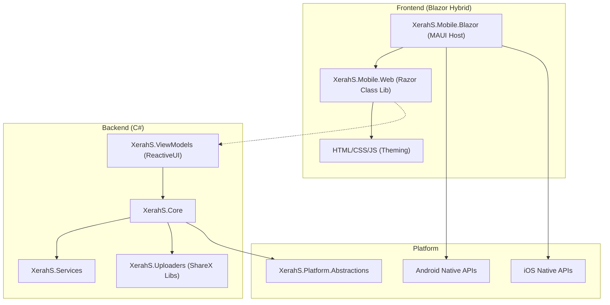

# Feasibility Report: Migrating to JS/CSS Frontend with C# Backend

## I. Executive Summary

**Verdict:** **Highly Feasible** via **MAUI Blazor Hybrid**.

The existing `XerahS` solution is well-architected for this migration. The separation of concerns between `Core`/`ViewModels` and `UI` suggests that ~80% of the codebase (the business logic) can be preserved as-is.

**The Plan:**
1.  **Preserve** the pure C# backend (`Core`, `Services`, `Uploaders`, `ViewModels`).
2.  **Replace** the Avalonia UI layer (`Mobile.UI`, `Mobile.Android`, `Mobile.iOS`) with a **Blazor Hybrid** layer (`Mobile.Web`, `Mobile.Blazor`).
3.  **Refactor** abstractions to remove the hard dependency on Avalonia, allowing the backend to serve both the legacy Desktop app (Avalonia) and the new Mobile app (Blazor) if desired, or just move entirely to Blazor.

---

## II. Detailed Project Analysis

The following table analyzes **every single `.csproj` file** in `src/` (31 total), listed alphabetically.

| Project File (Alphabetical) | Status | Type | Action | Migration Analysis & Comments |
| :--- | :--- | :--- | :--- | :--- |
| `Plugins\ShareX.AmazonS3.Plugin\XerahS.AmazonS3.Plugin.csproj` | 🟢 | Plugin | **KEEP** | Standard library w/ `XerahS.Uploaders` dependency. Safe to keep. |
| `Plugins\ShareX.Auto.Plugin\XerahS.Auto.Plugin.csproj` | 🟢 | Plugin | **KEEP** | Standard library. Safe to keep. |
| `Plugins\ShareX.GitHubGist.Plugin\XerahS.GitHubGist.Plugin.csproj` | 🟢 | Plugin | **KEEP** | Standard library. Safe to keep. |
| `Plugins\ShareX.Imgur.Plugin\XerahS.Imgur.Plugin.csproj` | 🟢 | Plugin | **KEEP** | Standard library. Safe to keep. |
| `Plugins\ShareX.Paste2.Plugin\XerahS.Paste2.Plugin.csproj` | 🟢 | Plugin | **KEEP** | Standard library. Safe to keep. |
| `XerahS.App\XerahS.App.csproj` | ⚪ | Desktop Head | **IGNORE** | This is the *Desktop* entry point (Avalonia). It sits alongside the new Mobile projects. Ignored for mobile migration. |
| `XerahS.Audits.Tool\XerahS.Audits.Tool.csproj` | 🟢 | Tool | **KEEP** | Dev tool. No impact on mobile app. |
| `XerahS.Bootstrap\XerahS.Bootstrap.csproj` | 🟢 | Logic | **KEEP** | Dependency Injection setup. Reuse this logic in `MauiProgram.cs` to wire up services. |
| `XerahS.CLI\XerahS.CLI.csproj` | 🟢 | CLI | **KEEP** | Command-line interface. Independent of UI. |
| `XerahS.Common\XerahS.Common.csproj` | 🟢 | Library | **KEEP** | Core helpers/extensions. Used everywhere. Indispensable. |
| `XerahS.Core\XerahS.Core.csproj` | 🟢 | Library | **KEEP** | **The Brain.** Contains 100% of business logic. Must be preserved and referenced by the new Blazor app. |
| `XerahS.History\XerahS.History.csproj` | 🟢 | Library | **KEEP** | Database logic for history. UI-agnostic. |
| `XerahS.Indexer\XerahS.Indexer.csproj` | 🟢 | Library | **KEEP** | File indexing logic. UI-agnostic. |
| `XerahS.Media\XerahS.Media.csproj` | 🟢 | Library | **KEEP** | Image/Video processing (FFmpeg/Skia). Critical for functionality. |
| `XerahS.Mobile.Android\XerahS.Mobile.Android.csproj` | 🔴 | Mobile Head | **REPLACE** | **Action:** Create `XerahS.Mobile.Blazor` instead. This project currently bootstraps Avalonia on Android. |
| `XerahS.Mobile.Maui\XerahS.Mobile.Maui.csproj` | 🔴 | Mobile Head | **REPLACE** | **Action:** Consolidate into `XerahS.Mobile.Blazor`. This was likely an alternative experiment. |
| `XerahS.Mobile.UI\XerahS.Mobile.UI.csproj` | 🔴 | Mobile UI | **REPLACE** | **Action:** Create `XerahS.Mobile.Web` (Razor Class Lib). This is where all the Avalonia Views live; they must be rewritten as `.razor` + CSS. |
| `XerahS.Mobile.iOS\XerahS.Mobile.iOS.csproj` | 🔴 | Mobile Head | **REPLACE** | **Action:** Create `XerahS.Mobile.Blazor` (configured for iOS). Bootstraps Avalonia on iOS. |
| `XerahS.Mobile.iOS.ShareExtension\XerahS.Mobile.iOS.ShareExtension.csproj` | 🟡 | Extension | **REFACTOR** | Native iOS extension. logic should remain, but ensure it shares data/settings with the new bundle ID of the Blazor app. |
| `XerahS.Platform.Abstractions\XerahS.Platform.Abstractions.csproj` | 🟡 | Library | **REFACTOR** | **Crucial Step:** Remove `<PackageReference Include="Avalonia" />`. Check `CrossPlatformTypes.cs` and refactor any Avalonia-specific types to use `System.Drawing` or `SkiaSharp` primitives. |
| `XerahS.Platform.Linux\XerahS.Platform.Linux.csproj` | ⚪ | Desktop Lib | **IGNORE** | Linux-specific implementation. Not relevant for Mobile. |
| `XerahS.Platform.MacOS\XerahS.Platform.MacOS.csproj` | ⚪ | Desktop Lib | **IGNORE** | macOS-specific (Desktop) implementation. Not relevant for Mobile. |
| `XerahS.Platform.Mobile\XerahS.Platform.Mobile.csproj` | 🟡 | Mobile Lib | **REFACTOR** | Contains native Android/iOS service implementations (Clipboard, Toast, etc.). Extract the logic to use in the new MAUI Blazor project (or implementation of interfaces for it). |
| `XerahS.Platform.Windows\XerahS.Platform.Windows.csproj` | ⚪ | Desktop Lib | **IGNORE** | Windows-specific implementation. Not relevant for Mobile. |
| `XerahS.PluginExporter\XerahS.PluginExporter.csproj` | 🟢 | Tool | **KEEP** | Build tool. Safe. |
| `XerahS.RegionCapture\XerahS.RegionCapture.csproj` | 🔴 | Desktop Tool | **REWRITE** | **Action:** See "Region Capture Strategy" below. This project is heavily desktop-bound (Avalonia.Desktop, PInvoke). You need a new "Web Overlay" or "MAUI GraphicsView" solution for mobile region selection. |
| `XerahS.Services\XerahS.Services.csproj` | 🟢 | Library | **KEEP** | Pure C# service implementations. Reuse 100%. |
| `XerahS.Services.Abstractions\XerahS.Services.Abstractions.csproj` | 🟢 | Library | **KEEP** | Service interfaces. Reuse 100%. |
| `XerahS.UI\XerahS.UI.csproj` | ⚪ | Desktop UI | **IGNORE** | The main Desktop UI library (Avalonia). Ignored for mobile migration. |
| `XerahS.Uploaders\XerahS.Uploaders.csproj` | 🟢 | Library | **KEEP** | **Core Value.** Contains all uploader logic. UI-independent. |
| `XerahS.ViewModels\XerahS.ViewModels.csproj` | 🟢 | Library | **KEEP** | **Gold Mine.** Contains the presentation logic. You can bind your new Blazor components directly to these existing ViewModels (ReactiveUI). |

---

## III. New Architecture Diagram

## IV. Next Steps

1.  **Refactor**: Edit `XerahS.Platform.Abstractions.csproj` to remove the Avalonia dependency.
2.  **Initialize**: Create the new `XerahS.Mobile.Blazor` and `XerahS.Mobile.Web` projects.
3.  **Proof of Concept**: Port the `MainViewModel` to a simple Blazor page to verify the binding loop.
