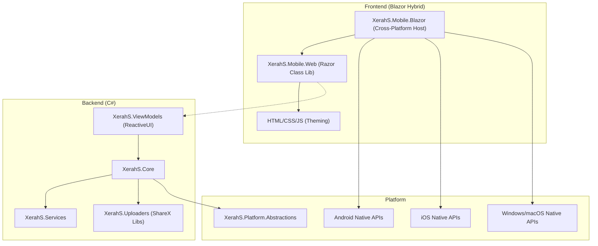

# Feasibility Report: Migrating to JS/CSS Frontend with C# Backend

## I. Executive Summary

**Verdict:** **Highly Feasible** via **MAUI Blazor Hybrid**.

The existing `XerahS` solution is well-architected for this migration. The separation of concerns between `Core`/`ViewModels` and `UI` suggests that ~80% of the codebase (the business logic) can be preserved as-is.

**The Plan:**
1.  **Preserve** the pure C# backend (`Core`, `Services`, `Uploaders`, `ViewModels`).
2.  **Replace** the Avalonia UI layer for **ALL platforms** (Mobile & Desktop) with a unified **Blazor Hybrid** layer (`Mobile.Web`, `Mobile.Blazor`).
3.  **Refactor** abstractions to remove the hard dependency on Avalonia, allowing the backend to serve the new Cross-Platform Blazor app on Windows, macOS, Linux, Android, and iOS.

---

## II. Detailed Project Analysis

The following table analyzes **every single `.csproj` file** in `src/` (31 total), listed alphabetically.

| Project File (Alphabetical) | Status | Type | Action | Migration Analysis & Comments |
| :--- | :--- | :--- | :--- | :--- |
| `XerahS.AmazonS3.Plugin.csproj` `Plugins\ShareX.AmazonS3.Plugin` | 🟢 | Plugin | **KEEP** | Standard library w/ `XerahS.Uploaders` dependency. Safe to keep. |
| `XerahS.Auto.Plugin.csproj` `Plugins\ShareX.Auto.Plugin` | 🟢 | Plugin | **KEEP** | Standard library. Safe to keep. |
| `XerahS.GitHubGist.Plugin.csproj` `Plugins\ShareX.GitHubGist.Plugin` | 🟢 | Plugin | **KEEP** | Standard library. Safe to keep. |
| `XerahS.Imgur.Plugin.csproj` `Plugins\ShareX.Imgur.Plugin` | 🟢 | Plugin | **KEEP** | Standard library. Safe to keep. |
| `XerahS.Paste2.Plugin.csproj` `Plugins\ShareX.Paste2.Plugin` | 🟢 | Plugin | **KEEP** | Standard library. Safe to keep. |
| `XerahS.App.csproj` `XerahS.App` | ⚪ | Desktop Head | **IGNORE/REPLACE** | Current *Desktop* entry point (Avalonia). Can be replaced by the new Cross-Platform Host for a unified experience on Windows/macOS/Linux. |
| `XerahS.Audits.Tool.csproj` `XerahS.Audits.Tool` | 🟢 | Tool | **KEEP** | Dev tool. No impact on app migration. |
| `XerahS.Bootstrap.csproj` `XerahS.Bootstrap` | 🟢 | Logic | **KEEP** | Dependency Injection setup. Reuse this logic in `MauiProgram.cs` to wire up services for all platforms. |
| `XerahS.CLI.csproj` `XerahS.CLI` | 🟢 | CLI | **KEEP** | Command-line interface. Independent of UI. |
| `XerahS.Common.csproj` `XerahS.Common` | 🟢 | Library | **KEEP** | Core helpers/extensions. Used everywhere. Indispensable. |
| `XerahS.Core.csproj` `XerahS.Core` | 🟢 | Library | **KEEP** | **The Brain.** Contains 100% of business logic. Must be preserved and referenced by the new Blazor app. |
| `XerahS.History.csproj` `XerahS.History` | 🟢 | Library | **KEEP** | Database logic for history. UI-agnostic. |
| `XerahS.Indexer.csproj` `XerahS.Indexer` | 🟢 | Library | **KEEP** | File indexing logic. UI-agnostic. |
| `XerahS.Media.csproj` `XerahS.Media` | 🟢 | Library | **KEEP** | Image/Video processing (FFmpeg/Skia). Critical for functionality. |
| `XerahS.Mobile.Android.csproj` `XerahS.Mobile.Android` | 🔴 | Mobile Head | **REPLACE** | **Action:** Create `XerahS.Mobile.Blazor` (Platform Host) instead. This project currently bootstraps Avalonia on Android. |
| `XerahS.Mobile.Maui.csproj` `XerahS.Mobile.Maui` | 🔴 | Mobile Head | **REPLACE** | **Action:** Consolidate into `XerahS.Mobile.Blazor` (Platform Host). |
| `XerahS.Mobile.UI.csproj` `XerahS.Mobile.UI` | 🔴 | Mobile UI | **REPLACE** | **Action:** Create `XerahS.Mobile.Web` (Razor Class Lib). This is where all the Avalonia Views live; they must be rewritten as `.razor` + CSS. |
| `XerahS.Mobile.iOS.csproj` `XerahS.Mobile.iOS` | 🔴 | Mobile Head | **REPLACE** | **Action:** Create `XerahS.Mobile.Blazor` (Platform Host) configured for iOS. Bootstraps Avalonia on iOS. |
| `XerahS.Mobile.iOS.ShareExtension.csproj` `XerahS.Mobile.iOS.ShareExtension` | 🟡 | Extension | **REFACTOR** | Native iOS extension. logic should remain, but ensure it shares data/settings with the new bundle ID of the Blazor app. |
| `XerahS.Platform.Abstractions.csproj` `XerahS.Platform.Abstractions` | 🟡 | Library | **REFACTOR** | **Crucial Step:** Remove `<PackageReference Include="Avalonia" />`. Check `CrossPlatformTypes.cs` and refactor any Avalonia-specific types to use `System.Drawing` or `SkiaSharp` primitives. |
| `XerahS.Platform.Linux.csproj` `XerahS.Platform.Linux` | ⚪ | Desktop Lib | **IGNORE/REPLACE** | Linux-specific implementation (Avalonia). Replace with Photino or Cross-Platform implementations. |
| `XerahS.Platform.MacOS.csproj` `XerahS.Platform.MacOS` | ⚪ | Desktop Lib | **IGNORE/REPLACE** | macOS-specific (Desktop) implementation (Avalonia). Replace with MAUI Catalyst or Cross-Platform implementations. |
| `XerahS.Platform.Mobile.csproj` `XerahS.Platform.Mobile` | 🟡 | Mobile Lib | **REFACTOR** | Contains native Android/iOS service implementations. Extract the logic to use in the new Cross-Platform Host project. |
| `XerahS.Platform.Windows.csproj` `XerahS.Platform.Windows` | ⚪ | Desktop Lib | **IGNORE/REPLACE** | Windows-specific implementation (Avalonia). Replace with MAUI WinUI3 or Cross-Platform implementations. |
| `XerahS.PluginExporter.csproj` `XerahS.PluginExporter` | 🟢 | Tool | **KEEP** | Build tool. Safe. |
| `XerahS.RegionCapture.csproj` `XerahS.RegionCapture` | 🔴 | Desktop Tool | **REWRITE** | **Action:** See "Region Capture Strategy" below. Heavily desktop-bound (Avalonia.Desktop). Requires a new Cross-Platform "Web Overlay" or "MAUI GraphicsView" solution. |
| `XerahS.Services.csproj` `XerahS.Services` | 🟢 | Library | **KEEP** | Pure C# service implementations. Reuse 100%. |
| `XerahS.Services.Abstractions.csproj` `XerahS.Services.Abstractions` | 🟢 | Library | **KEEP** | Service interfaces. Reuse 100%. |
| `XerahS.UI.csproj` `XerahS.UI` | ⚪ | Desktop UI | **IGNORE/REPLACE** | The main Desktop UI library (Avalonia). Replace with `XerahS.Mobile.Web` for a unified JS/CSS look. |
| `XerahS.Uploaders.csproj` `XerahS.Uploaders` | 🟢 | Library | **KEEP** | **Core Value.** Contains all uploader logic. UI-independent. |
| `XerahS.ViewModels.csproj` `XerahS.ViewModels` | 🟢 | Library | **KEEP** | **Gold Mine.** Contains the presentation logic. You can bind your new Blazor components directly to these existing ViewModels (ReactiveUI). |

### Region Capture Strategy

The `XerahS.RegionCapture` project is currently heavily dependent on `Avalonia.Desktop` and Windows-specific PInvoke calls, making it unsuitable for a unified **Cross-Platform** architecture (both Mobile and Non-Windows Desktop).

**Migration Plan:**
1.  **Extract Core Logic:** Move non-UI logic (coordinate system, selection modes, geometry calculations) to `XerahS.Core` or a new `XerahS.RegionCapture.Core` library.
2.  **Cross-Platform Implementation:**
    *   **Option A (Recommended):** Use a fullscreen **HTML5 `<canvas>`** overlay within the Blazor WebView. This aligns with the request for JS/CSS styling and ensures a consistent rendering experience across **Mobile and Desktop**.
    *   **Option B (Alternative):** Use a transparent native **MAUI `GraphicsView`** overlay if web canvas performance proves insufficient for high-refresh-rate selection.

---

---

## III. Frontend Capability Matrix by OS

The following table outlines how the proposed **Blazor Hybrid** architecture supports each platform.

| Platform | Capability | Technology Stack | Status / Notes |
| :--- | :--- | :--- | :--- |
| **Android** | ✅ **Full Support** | **MAUI Blazor** | **Primary Target.** Uses Android System WebView. Full access to native APIs via .NET. |
| **iOS** | ✅ **Full Support** | **MAUI Blazor** | **Primary Target.** Uses `WKWebView`. Full access to native APIs via .NET. |
| **Windows** | ✅ **Full Support** | **MAUI Blazor (WinUI 3)** | **Optional.** The new stack *can* fully replace the Avalonia Desktop app if desired, using WebView2 (Edge Chromium). |
| **macOS** | ✅ **Full Support** | **MAUI Blazor (Catalyst)** | **Optional.** The new stack *can* fully replace the Avalonia Desktop app if desired, using `WKWebView`. |
| **Linux** | ⚠️ **Partial** | **Photino** or **Avalonia Hybrid** | **Complex.** MAUI has no official Linux support. To run the new HTML/CSS UI on Linux, we would need to host the Blazor components inside a **Photino** shell or embed a `BlazorWebView` within the existing **Avalonia** app. |

## IV. New Architecture Diagram

## V. Trade-offs & Concessions

Migrating to a **Blazor Hybrid (HTML/CSS)** architecture involves the following trade-offs compared to the current Avalonia implementation:

1.  **"Pixel-Perfect" Desktop Native Feel:**
    *   **Give Up:** The specific "desktop application" feel of Avalonia/WPF controls.
    *   **Trade:** The UI will behave like a modern Web Application. Text rendering, scrolling physics, and focus indicators will be governed by the browser engine (WebView), not the OS native toolkit.

2.  **Complex Window Management:**
    *   **Give Up:** Easy, declarative definition of multi-window layouts (floating toolbars, detached panels) within the shared UI code.
    *   **Trade:** The Web UI is inherently "single-page". Secondary windows must be orchestrated by the **Host (MAUI)** via platform channels, increasing complexity for features like "Tear-off tabs" or "Floating Widgets".

3.  **Legacy Platform Support:**
    *   **Give Up:** Support for older OS versions that lack modern WebViews (e.g., very old Android versions, unpatched Windows 10/11 without WebView2).
    *   **Trade:** strict requirement for **Android System WebView**, **WKWebView**, or **Edge WebView2**.

4.  **Immediate Access to Region Capture:**
    *   **Give Up:** The battle-tested, PInvoke-heavy desktop region capture tool.
    *   **Trade:** This feature requires a **complete rewrite**. The initial HTML5 Canvas replacement may lack some mature features (magnifier smoothing, multi-monitor edge cases) until fully developed.

## VI. Next Steps

1.  **Refactor**: Edit `XerahS.Platform.Abstractions.csproj` to remove the Avalonia dependency.
2.  **Initialize**: Create the new `XerahS.Mobile.Blazor` and `XerahS.Mobile.Web` projects.
3.  **Proof of Concept**: Port the `MainViewModel` to a simple Blazor page to verify the binding loop.
