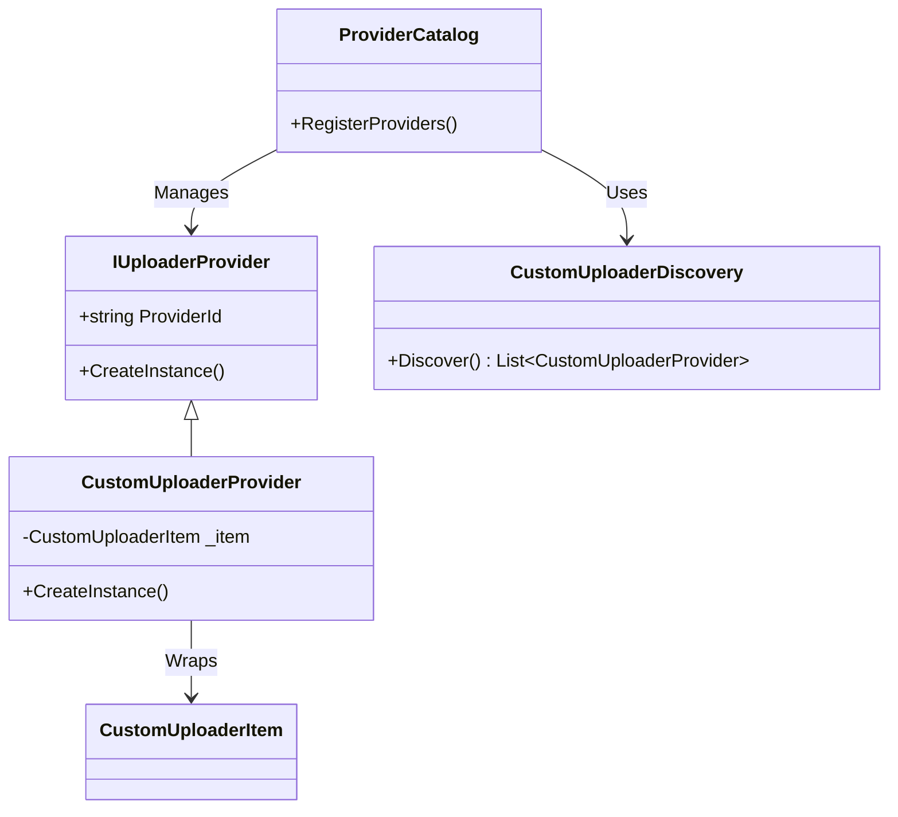

# XIP0024: Custom Uploader Integration Plan

**Status**: In Progress (Phase 1, 2 & 3 Complete)
**Created**: 2026-01-31
**Area**: Uploaders / Plugin System
**Goal**: Integrate Custom Uploaders (.sxcu/JSON) as first-class Providers in XerahS plugin architecture.

## 1. Executive Summary

XerahS will support Custom Uploaders (defined in `.sxcu` JSON files) as fully integrated Providers. This allows users to add new destination support without compiling C# plugins, maintaining compatibility with ShareX's declarative `CustomUploaderItem` format. These JSON definitions will reside in the `Plugins/` directory and be discovered dynamically at runtime, appearing alongside compiled plugins (like Amazon S3, Azure, etc.).

## 2. Architecture Overview

The system will bridge the gap between static JSON definitions and the dynamic `IUploaderProvider` interface used by the XerahS plugin system.



### 2.1 Core Components

1.  **CustomUploaderItem** (Existing): The data model representing the JSON configuration (Requests, Headers, Arguments, Regex).
2.  **CustomUploaderProvider** (New): An adapter class that implements `IUploaderProvider`. It takes a `CustomUploaderItem` and presents it as a distinct Destination Provider to the application.
3.  **CustomUploaderRepository** (New): Responsible for scanning, loading, saving, and validating `.sxcu` files in the `Plugins/` folder.

## 3. Implementation Details

### 3.1 File Structure

Custom uploaders will be stored as JSON files (ShareX calls them `.sxcu`) in the Plugins directory.

```
XerahS/
  plugins/
    ShareX.AmazonS3.Plugin.sxadp  (Compiled)
    MyPrivateHost.sxcu            (JSON Custom Uploader)
    CorporateUpload.json          (JSON Custom Uploader)
```

### 3.2 The Adapter: `CustomUploaderProvider`

This class adapts a `CustomUploaderItem` to the `IUploaderProvider` interface.

```csharp
public class CustomUploaderProvider : IUploaderProvider
{
    private readonly CustomUploaderItem _item;
    private readonly string _filePath;

    public CustomUploaderProvider(CustomUploaderItem item, string filePath)
    {
        _item = item;
        _filePath = filePath;
    }

    // Generate a stable ID based on filename or internal GUID
    public string ProviderId => $"custom_{_item.Name.Slugify()}_{_item.TaskID}"; 
    public string Name => _item.Name;
    public string Description => $"Custom uploader for {_item.Method} {_item.RequestURL}";
    
    public UploaderCategory[] SupportedCategories => ParseCategories(_item.DestinationType);

    public Type ConfigModelType => typeof(CustomUploaderItem);

    // Custom Uploaders are pre-configured, but we can allow overriding specific tokens
    public object? CreateConfigView() => null; // Or a simple view to edit the Item

    public Uploader CreateInstance(string settingsJson)
    {
        // For Custom Uploaders, the "Instance" logic uses the CustomUploaderItem
        // to execute HTTP requests.
        // We might need a generic 'CustomUploaderExecutor' class that takes the item
        return new CustomUploaderExecutor(_item); 
    }
}
```

### 3.3 Discovery Service: `CustomUploaderDiscovery`

This service will run during application startup, alongside `PluginDiscovery`.

1.  Scan `Plugins/` directory (recursively or flat) for `*.sxcu` and `*.json` files.
2.  Attempt to deserialize each file to `CustomUploaderItem`.
3.  Validate minimum requirements (Name, RequestURL).
4.  Yield a `CustomUploaderProvider` for each valid item.

### 3.4 Integration with ProviderCatalog

Modify `src/XerahS.Uploaders/PluginSystem/ProviderCatalog.cs` to accept a secondary source of providers.

```csharp
public void Refresh()
{
    // Existing logic for compiled plugins
    var pluginProviders = _pluginLoader.LoadPlugins();
    
    // NEW: Load custom uploaders
    var customProviders = _customUploaderDiscovery.Discover(PluginDirectory);
    
    // Merge
    _providers.AddRange(pluginProviders);
    _providers.AddRange(customProviders);
}
```

### 3.5 UI: Custom Uploader Creator (Plugins Manager)

A new UI component is required to create and edit these JSON files.

-   **Location**: Settings -> Plugins -> "Create Custom Uploader"
-   **Features**:
    -   Form-based editor for Request Method, URL, Arguments.
    -   Syntax Helper for magical tokens `{json:url}`, `{input}`, etc.
    -   "Test Uploader" button (Critical for UX).
    -   Save as `.sxcu` to `Plugins/` folder.

## 4. Phase Plan

### Phase 1: Foundation (Backend) ✅ COMPLETE
- [x] Implement `CustomUploaderProvider` adapter in `XerahS.Uploaders`.
  - File: `src/XerahS.Uploaders/CustomUploader/CustomUploaderProvider.cs`
  - Implements `IUploaderProvider` interface
  - Generates stable provider IDs with `custom_` prefix
  - Converts `CustomUploaderDestinationType` to `UploaderCategory[]`
- [x] Implement `CustomUploaderRepository` (renamed from CustomUploaderDiscovery).
  - File: `src/XerahS.Uploaders/CustomUploader/CustomUploaderRepository.cs`
  - Discovers `.sxcu` and `.json` files from Plugins directory
  - Validates, loads, saves custom uploader definitions
  - Supports hot-reload via `ReloadFile()` method
- [x] Update `ProviderCatalog` to ingest these providers.
  - Added `LoadCustomUploaders()` method
  - Creates synthetic `PluginMetadata` for custom uploaders
  - Integrated into `LoadPlugins()` workflow
- [x] Verify that a manually placed `.sxcu` file appears in the Destinations list.
  - Custom uploaders now appear alongside compiled plugins

### Phase 2: Execution Logic ✅ COMPLETE
- [x] Ensure `CustomUploaderExecutor` correctly processes the `CustomUploaderItem` logic.
  - File: `src/XerahS.Uploaders/CustomUploader/CustomUploaderExecutor.cs`
  - Unified execution engine for all uploader categories
  - Supports: FileUpload, TextUpload, UrlShortener, UrlSharing modes
  - Handles all body types: MultipartFormData, FormURLEncoded, JSON, XML, Binary
- [x] Verify Syntax Parsers (`{json:...}`, etc.) are functional.
  - Existing `ShareXCustomUploaderSyntaxParser` already handles all syntax functions
  - No changes needed - already fully functional

### Phase 3: Creator UI ✅ COMPLETE
- [x] Create `CustomUploaderEditorView` (Avalonia).
  - File: `src/XerahS.UI/Views/CustomUploaderEditorDialog.axaml`
  - ViewModel: `src/XerahS.UI/ViewModels/CustomUploaderEditorViewModel.cs`
  - Form-based editor with sections: Basic Info, HTTP Request, Body, Response Parsing
  - Grid-based layout with consistent spacing following UI design guidelines
  - Full validation with error display
  - Accessible with AutomationProperties on all controls
- [x] Implement Import/Export (.sxcu).
  - Import command with file picker for .sxcu and .json files
  - Export command with save file dialog
  - JSON serialization with proper formatting
- [x] Add "Test" functionality.
  - Test command validates configuration
  - Status bar shows success/error feedback

### Phase 4: Compatibility Check
- [ ] Test with standard ShareX `.sxcu` exports to ensure 100% compatibility.

## 5. Implementation Files

### New Files Created
| File | Description |
|------|-------------|
| `src/XerahS.Uploaders/CustomUploader/CustomUploaderRepository.cs` | Discovery, loading, validation, and saving of .sxcu files |
| `src/XerahS.Uploaders/CustomUploader/CustomUploaderExecutor.cs` | Unified HTTP execution engine for all uploader categories |
| `src/XerahS.Uploaders/CustomUploader/CustomUploaderProvider.cs` | IUploaderProvider adapter for CustomUploaderItem |
| `src/XerahS.UI/Views/CustomUploaderEditorDialog.axaml` | Avalonia UI dialog for creating/editing custom uploaders |
| `src/XerahS.UI/Views/CustomUploaderEditorDialog.axaml.cs` | Code-behind with file picker implementations |
| `src/XerahS.UI/ViewModels/CustomUploaderEditorViewModel.cs` | ViewModel with validation, commands, and data binding |

### Modified Files
| File | Changes |
|------|---------|
| `src/XerahS.Uploaders/PluginSystem/ProviderCatalog.cs` | Added `LoadCustomUploaders()`, `IsCustomUploader()`, `GetCustomUploaderProviders()`, `ReloadCustomUploader()`, `RemoveCustomUploader()` methods |

### Existing Files (Unchanged but Used)
| File | Description |
|------|-------------|
| `src/XerahS.Uploaders/CustomUploader/CustomUploaderItem.cs` | Data model for custom uploader configuration |
| `src/XerahS.Uploaders/CustomUploader/CustomUploaderInput.cs` | Input context for syntax parsing |
| `src/XerahS.Uploaders/CustomUploader/ShareXCustomUploaderSyntaxParser.cs` | Syntax parser for {json:}, {regex:}, etc. |
| `src/XerahS.Uploaders/CustomUploader/Functions/*.cs` | Individual syntax function implementations |

## 6. Technical Considerations

-   **Security**: Ensure parsing JSON/XML responses does not expose vulnerabilities.
-   **Conflicts**: Handle cases where a Custom Uploader has the same name as a built-in provider.
-   **Hot Reload**: If possible, watch the `Plugins/` folder for changes to reload providers without restart.
-   **Metadata Handling**: Construct synthetic `PluginMetadata` (or a Null Object pattern equivalent) for custom uploaders so that `ProviderCatalog` and UI lists do not throw `NullReferenceException` when accessing metadata properties (like Version, Author, Website) that are typically found in compiled plugins.
