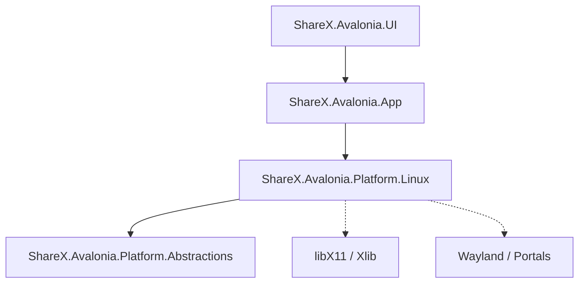

# SIP0014: Linux Support Implementation Plan

**Created**: 2026-01-04
**Status**: Draft
**Priority**: High (Cross-platform compatibility)

---

## Executive Summary

This document outlines the plan to implement Linux support for ShareX.Avalonia. The goal is to bring the application to the Linux ecosystem by implementing platform-specific services for window management, screen capture, and environment integration. The implementation will prioritize broad compatibility (X11) while acknowledging Wayland limitations.

---

## Part 1: Platform Analysis

### Architecture Overview

ShareX.Avalonia uses a platform abstraction layer to isolate OS-specific dependencies. The Core and UI projects are platform-agnostic, relying on interfaces defined in `ShareX.Avalonia.Platform.Abstractions`.

### Key Components to Implement

| Interface | Purpose | Linux Challenge |
|-----------|---------|-----------------|
| `IPlatformInfo` | OS detection (Distro, Desktop Environment) | Detecting DE (GNOME, KDE) vs just "Linux" |
| `IWindowService` | Window enumeration, focus, bounds | X11 is straightforward. Wayland restricts global window management. |
| `IScreenCaptureService` | Capturing screen/regions | X11 `XGetImage` works. Wayland requires Portal API (xdg-desktop-portal). |
| `IClipboardService` | Clipboard operations | `xclip` / `wl-copy` or Avalonia's built-in support. |
| `IHotkeyService` | Global hotkeys | X11 `XGrabKey`. Wayland requires GlobalShortcuts portal. |

---

## Part 2: Proposed Architecture

### Project Structure

We will create a new project `ShareX.Avalonia.Platform.Linux` to house all Linux-specific implementations.



### Strategy: X11 First

Given the complexity of Wayland's security model (which blocks global hotkeys and window enumeration by default), the MVP will target **X11**. Most modern Linux distros still support XWayland or X11 sessions, making this a viable starting point.

For Wayland native support, we will eventually need to implement DBus communication with `xdg-desktop-portal`.

---

## Part 3: Implementation Phases

### Phase 0: Development Process

1.  Create a new feature branch for development (`feature/linux-support`).
2.  Commit changes incrementally.
3.  Push to remote repository for backup and review.

### Phase 1: Project Setup (MVP)

1.  **Create Project**: `ShareX.Avalonia.Platform.Linux` (.NET 8.0 Class Library).
2.  **Dependencies**:
    -   `ShareX.Avalonia.Platform.Abstractions`
    -   `Avalonia.X11` (likely needed for XID retrieval) or usage of `System.Runtime.InteropServices` for P/Invoke `libX11`.

### Phase 2: Environment & Helper Services

Implement `LinuxPlatformInfo`:
-   Detect `IsLinux = true`.
-   Detect `DesktopEnvironment` (reading `$XDG_CURRENT_DESKTOP`).
-   Detect Session Type (X11 vs Wayland via `$XDG_SESSION_TYPE`).

### Phase 3: Window Manager (X11)

Implement `LinuxWindowService : IWindowService`:
-   **P/Invoke**: Use `libX11` to enumerate windows (`XQueryTree`).
-   **Window Props**: Get title (`XFetchName`), bounds (`XGetWindowAttributes`), and visibility.
-   **Focus**: `XSetInputFocus`.

*Note*: For the MVP, we might use a CLI wrapper (like `wmctrl`) if P/Invoke proves too brittle, but P/Invoke is preferred for performance.

### Phase 4: Screen Capture

Implement `LinuxScreenCaptureService`:
-   **Native**: `XGetImage` for X11.
-   **CLI Fallback**: Support `gnome-screenshot`, `scrot`, or `spectacle` command-line execution as a robust fallback.

### Phase 5: Integration

Update `App.axaml.cs` to transparently load Linux services when running on Linux.

```csharp
if (RuntimeInformation.IsOSPlatform(OSPlatform.Linux))
{
    // Register Linux services
    ServiceCollection.AddSingleton<IPlatformInfo, LinuxPlatformInfo>();
    ServiceCollection.AddSingleton<IWindowService, LinuxWindowService>();
    // ...
}
```

---

## Part 4: Technical Risks

1.  **Wayland Compatibility**:
    -   *Risk*: Features like "Active Window" capture or "Window Scrolling" are fundamentally restricted in Wayland.
    -   *Mitigation*: Explicitly warn user on Wayland; implement `xdg-desktop-portal` later; fallback to full screen capture.
2.  **Distro Fragmentation**:
    -   *Risk*: Behavior differs between Ubuntu, Fedora, Arch, etc.
    -   *Mitigation*: Target "Freedesktop.org" standards (XDG) rather than distro specifics.

---

## Part 5: Next Steps

1.  Create the `ShareX.Avalonia.Platform.Linux` project.
2.  Stub out the interfaces.
3.  Implement `LinuxPlatformInfo` first (easiest).
4.  Begin X11 P/Invoke research for `LinuxWindowService`.
