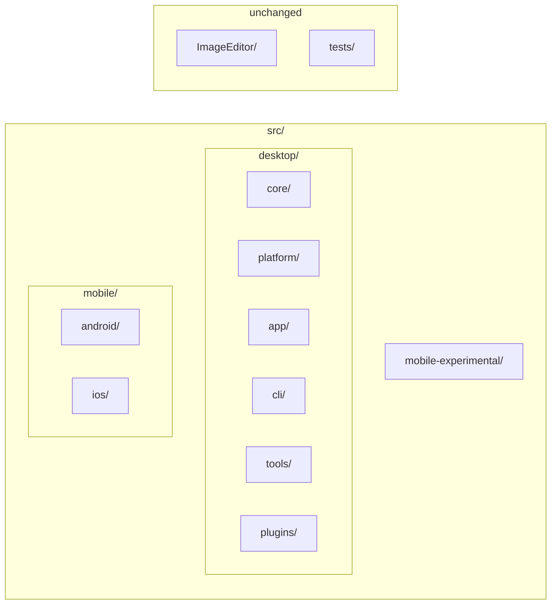

# XerahS repository file reorganisation plan

## Current state

- **Root**: [XerahS.sln](XerahS.sln), [Directory.Build.props](Directory.Build.props), [ImageEditor/](ImageEditor/) (own solution, submodule), [tests/](tests/), docs/, .github/, .ai/, .githooks/, etc.
- **src/** (flat): ~28 C# projects plus:
  - [src/Plugins/](src/Plugins/) with 5 plugins in **ShareX.*** folders but **XerahS.*** .csproj names
  - [src/XerahS.Mobile.Kt/](src/XerahS.Mobile.Kt/) (Kotlin/Gradle; not in .sln)
- **ImageEditor**: At root; githooks and [.github/workflows/imageeditor-submodule-enforce.yml](.github/workflows/imageeditor-submodule-enforce.yml) assume `ImageEditor/`; **do not move**.
- **tests/**: [tests/XerahS.Tests/](tests/XerahS.Tests/), [tests/ShareX.Avalonia.Tests/](tests/ShareX.Avalonia.Tests/) (naming inconsistency).

Project references use relative paths (e.g. `..\XerahS.Core\`, `..\Plugins\ShareX.AmazonS3.Plugin\`, `..\..\ImageEditor\src\ShareX.ImageEditor\`). Any move under `src/` will require updating those paths in every referring .csproj and in the solution file.

---

## Recommended structure (under `src/` only)

Organise by **what works together**: the .NET solution lives under **src/desktop/**; native mobile under **src/mobile/** with **android/** and **ios/** so one folder (`src/mobile/`) gives context for both platforms (agentic-friendly). ImageEditor and `tests/` stay at repo root.



**How to execute:** Implement with **extreme caution** in **stages** (one git commit per stage), starting with the least risky moves. See [Staged implementation (extreme caution)](#staged-implementation-extreme-caution) below. The [Execution order](#execution-order-mechanical-only) section is a single-pass reference only.

**Desktop stack** — under `src/desktop/`: core/, app/, cli/, tools/, plugins/. **Platform** (shared by desktop and mobile-experimental) is under `src/platform/` (sibling to desktop), not under desktop, so that XerahS.Platform.Mobile is not under a "desktop" path.

| Folder under `src/` | Projects / contents |
| ------------------- | -------------------- |
| **desktop/core/**   | XerahS.Core, XerahS.Common, XerahS.Services.Abstractions, XerahS.Services, XerahS.ViewModels, XerahS.History, XerahS.Indexer, XerahS.Uploaders, XerahS.Media |
| **platform/**       | XerahS.Platform.Abstractions, XerahS.Platform.Windows, XerahS.Platform.Linux, XerahS.Platform.MacOS, XerahS.Platform.Mobile (shared; used by desktop app and mobile-experimental) |
| **desktop/app/**    | XerahS.App, XerahS.UI, XerahS.Bootstrap, XerahS.RegionCapture (the desktop application) |
| **desktop/cli/**    | XerahS.CLI (product that shares core; sibling to app, not under tools) |
| **desktop/tools/**  | XerahS.WatchFolder.Daemon, XerahS.PluginExporter, XerahS.Audits.Tool |
| **desktop/plugins/** | Plugin folders with **short names** (no ShareX. prefix): AmazonS3.Plugin, Imgur.Plugin, Paste2.Plugin, GitHubGist.Plugin, Auto.Plugin |

**Experimental .NET mobile** — under **src/mobile-experimental/** (sibling to desktop and mobile):

| Folder                      | Projects to move here |
| --------------------------- | --------------------- |
| **src/mobile-experimental/** | XerahS.Mobile.Core, XerahS.Mobile.Ava, XerahS.Mobile.Maui, XerahS.Mobile.iOS.ShareExtension |

**Native mobile (separate stack)** — under **src/mobile/** so one path gives context for both platforms:

| Folder under `src/mobile/` | Contents |
| -------------------------- | -------- |
| **android/**               | Kotlin app (current **XerahS.Mobile.Kt** tree; folder name **android**, not XerahS.Mobile.Kt) |
| **ios/**                   | Swift app (current **XerahS.Mobile.Swift**; folder name **ios**, not XerahS.Mobile.Swift) |

After moves, paths look like:

- `src/desktop/core/XerahS.Core/XerahS.Core.csproj`
- `src/platform/XerahS.Platform.Abstractions/...` (shared by desktop and mobile-experimental)
- `src/desktop/app/XerahS.App/XerahS.App.csproj`
- `src/desktop/cli/XerahS.CLI/XerahS.CLI.csproj`
- `src/mobile-experimental/XerahS.Mobile.Ava/XerahS.Mobile.Ava.csproj`
- `src/desktop/plugins/Imgur.Plugin/...` (short path; .csproj remains XerahS.Imgur.Plugin.csproj)
- `src/mobile/android/` — Kotlin app (app/, core/, feature/, build.gradle.kts, etc.)
- `src/mobile/ios/` — Swift app

### Target folder tree (after reorg)

Full folder structure at repo root and under `src/` so the layout is clear:

```
XerahS/
├── .ai/
├── .github/
├── .githooks/
├── .cursorrules
├── .gitignore
├── AGENTS.md
├── Directory.Build.props
├── README.md
├── XerahS.sln
├── ImageEditor/                    (unchanged; submodule)
│   ├── src/
│   │   ├── ShareX.ImageEditor/
│   │   └── ShareX.ImageEditor.Loader/
│   └── ShareX.ImageEditor.sln
├── docs/
├── developers/
├── scripts/
├── tasks/
├── tests/
│   ├── XerahS.Tests/
│   └── ShareX.Avalonia.Tests/      (optional: rename to XerahS.Avalonia.Tests)
│
└── src/
    ├── desktop/                    (.NET stack — works together)
    │   ├── core/
    │   │   ├── XerahS.Core/
    │   │   ├── XerahS.Common/
    │   │   ├── XerahS.Services.Abstractions/
    │   │   ├── XerahS.Services/
    │   │   ├── XerahS.ViewModels/
    │   │   ├── XerahS.History/
    │   │   ├── XerahS.Indexer/
    │   │   ├── XerahS.Uploaders/
    │   │   └── XerahS.Media/
    │   ├── platform/
    │   │   ├── XerahS.Platform.Abstractions/
    │   │   ├── XerahS.Platform.Windows/
    │   │   ├── XerahS.Platform.Linux/
    │   │   ├── XerahS.Platform.MacOS/
    │   │   └── XerahS.Platform.Mobile/
    │   ├── app/                     (desktop application — not desktop/desktop)
    │   │   ├── XerahS.App/
    │   │   ├── XerahS.UI/
    │   │   ├── XerahS.Bootstrap/
    │   │   └── XerahS.RegionCapture/
    │   ├── cli/                     (CLI product — shares core, sibling to app)
    │   │   └── XerahS.CLI/
    │   ├── tools/
    │   │   ├── XerahS.WatchFolder.Daemon/
    │   │   ├── XerahS.PluginExporter/
    │   │   └── XerahS.Audits.Tool/
    │   ├── plugins/
    │   │   ├── AmazonS3.Plugin/
    │   │   ├── Imgur.Plugin/
    │   │   ├── Paste2.Plugin/
    │   │   ├── GitHubGist.Plugin/
    │   │   └── Auto.Plugin/
    │
    ├── mobile-experimental/       (experimental .NET mobile — Ava, Maui, etc.)
    │   ├── XerahS.Mobile.Core/
    │   ├── XerahS.Mobile.Ava/
    │   ├── XerahS.Mobile.Maui/
    │   └── XerahS.Mobile.iOS.ShareExtension/
    │
    └── mobile/                    (native apps — one folder = both platforms)
        ├── android/                (Kotlin; ex XerahS.Mobile.Kt)
        │   ├── app/
        │   ├── core/
        │   │   ├── common/
        │   │   ├── data/
        │   │   └── domain/
        │   ├── feature/
        │   │   ├── upload/
        │   │   ├── history/
        │   │   └── settings/
        │   ├── build.gradle.kts
        │   └── settings.gradle.kts
        └── ios/                    (Swift; ex XerahS.Mobile.Swift)
            └── ...
```

---

## Staged implementation (extreme caution)

Implement in **multiple stages**, each with its own **git commit** and **verify** (`dotnet build XerahS.sln`). Start with the **least risky** moves (most isolated) so a bad step is easy to revert. Order below is by isolation and dependency: mobile first (no .sln), then experimental, then CLI, then desktop in dependency order (core → platform → app → tools → plugins).

| Stage | What moves | Why this order | Commit message idea |
| ----- | ---------- | ----------------- | -------------------- |
| **1** | Native mobile | **Most isolated**: Kotlin not in .sln; Swift same. No .NET ProjectReferences. Only folder moves + docs/scripts. | `[XIP0036] Stage 1: move native mobile to src/mobile/android, src/mobile/ios` |
| **2** | Experimental .NET mobile | Isolated from desktop app. Move 4 projects; update .sln + their ProjectReferences (point to still-flat Core). | `[XIP0036] Stage 2: move experimental mobile to src/mobile-experimental` |
| **3** | CLI | Single product under new `src/desktop/cli/`. Rest of desktop still flat; only CLI and .sln paths change. | `[XIP0036] Stage 3: move CLI to src/desktop/cli` |
| **4** | Desktop core (9 mini-stages) | One project per commit. Create `src/desktop/core/` on first move; each mini-stage: move one project, update .sln and **every** ProjectReference to that project. | See table below. |
| **5** | Desktop platform (5 mini-stages) | One project per commit. Create `src/desktop/platform/` on first move; each mini-stage: move one project, update .sln and every ProjectReference to it. | See Stage 5 table below. |
| **6** | Desktop app (4 mini-stages) | One project per commit. Create `src/desktop/app/` on first move; each mini-stage: move one project, update .sln and every ProjectReference; UI move updates ImageEditor path. | See Stage 6 table below. |
| **7** | Desktop tools (3 mini-stages) | One project per commit. Create `src/desktop/tools/` on first move; each mini-stage: move one project, update .sln and every ProjectReference. | See Stage 7 table below. |
| **8** | Desktop plugins (5 mini-stages) | One plugin per commit. Create `src/desktop/plugins/` on first move; each mini-stage: move one plugin folder and **drop ShareX. prefix** (e.g. ShareX.AmazonS3.Plugin → plugins/AmazonS3.Plugin), update .sln path and solution folder name, update App _DefaultPlugins, mobile-experimental refs, and plugin’s own ProjectReferences to core. | See Stage 8 table below. |
| **9** | Docs/skills/scripts | Update .ai/skills (build-windows-exe, build-android, build-linux-binary), .githooks, scripts, docs. Optional: rename test folder. | `[XIP0036] Stage 9: update docs and skill paths for reorg` |

**Stage 4 mini-stages (one commit per core project)** — Create `src/desktop/core/` when moving the first project. For each row: move that project into `src/desktop/core/`, update .sln path for it, update every .csproj that references it (app, cli, mobile-experimental, tools, plugins, other core projects), then commit.

| Mini-stage | Project | Commit message idea |
| ---------- | ------- | -------------------- |
| **4a** | XerahS.Core | `[XIP0036] Stage 4a: move XerahS.Core to src/desktop/core` |
| **4b** | XerahS.Common | `[XIP0036] Stage 4b: move XerahS.Common to src/desktop/core` |
| **4c** | XerahS.Services.Abstractions | `[XIP0036] Stage 4c: move XerahS.Services.Abstractions to src/desktop/core` |
| **4d** | XerahS.Services | `[XIP0036] Stage 4d: move XerahS.Services to src/desktop/core` |
| **4e** | XerahS.ViewModels | `[XIP0036] Stage 4e: move XerahS.ViewModels to src/desktop/core` |
| **4f** | XerahS.History | `[XIP0036] Stage 4f: move XerahS.History to src/desktop/core` |
| **4g** | XerahS.Indexer | `[XIP0036] Stage 4g: move XerahS.Indexer to src/desktop/core` |
| **4h** | XerahS.Uploaders | `[XIP0036] Stage 4h: move XerahS.Uploaders to src/desktop/core` |
| **4i** | XerahS.Media | `[XIP0036] Stage 4i: move XerahS.Media to src/desktop/core` |

**Stage 5 mini-stages (one commit per platform project)** — Create `src/desktop/platform/` when moving the first project. For each row: move that project into `src/desktop/platform/`, update .sln path, update every .csproj that references it, then commit.

| Mini-stage | Project | Commit message idea |
| ---------- | ------- | -------------------- |
| **5a** | XerahS.Platform.Abstractions | `[XIP0036] Stage 5a: move XerahS.Platform.Abstractions to src/desktop/platform` |
| **5b** | XerahS.Platform.Windows | `[XIP0036] Stage 5b: move XerahS.Platform.Windows to src/desktop/platform` |
| **5c** | XerahS.Platform.Linux | `[XIP0036] Stage 5c: move XerahS.Platform.Linux to src/desktop/platform` |
| **5d** | XerahS.Platform.MacOS | `[XIP0036] Stage 5d: move XerahS.Platform.MacOS to src/desktop/platform` |
| **5e** | XerahS.Platform.Mobile | `[XIP0036] Stage 5e: move XerahS.Platform.Mobile to src/desktop/platform` |

**Stage 6 mini-stages (one commit per app project)** — Create `src/desktop/app/` when moving the first project. For each row: move that project into `src/desktop/app/`, update .sln path, update every .csproj that references it; for UI (6b) also update ImageEditor path to `..\..\..\..\ImageEditor\src\ShareX.ImageEditor\ShareX.ImageEditor.csproj`, then commit.

| Mini-stage | Project | Commit message idea |
| ---------- | ------- | -------------------- |
| **6a** | XerahS.Bootstrap | `[XIP0036] Stage 6a: move XerahS.Bootstrap to src/desktop/app` |
| **6b** | XerahS.UI | `[XIP0036] Stage 6b: move XerahS.UI to src/desktop/app` |
| **6c** | XerahS.RegionCapture | `[XIP0036] Stage 6c: move XerahS.RegionCapture to src/desktop/app` |
| **6d** | XerahS.App | `[XIP0036] Stage 6d: move XerahS.App to src/desktop/app` |

**Stage 7 mini-stages (one commit per tools project)** — Create `src/desktop/tools/` when moving the first project. For each row: move that project into `src/desktop/tools/`, update .sln path, update every .csproj that references it, then commit.

| Mini-stage | Project | Commit message idea |
| ---------- | ------- | -------------------- |
| **7a** | XerahS.WatchFolder.Daemon | `[XIP0036] Stage 7a: move XerahS.WatchFolder.Daemon to src/desktop/tools` |
| **7b** | XerahS.PluginExporter | `[XIP0036] Stage 7b: move XerahS.PluginExporter to src/desktop/tools` |
| **7c** | XerahS.Audits.Tool | `[XIP0036] Stage 7c: move XerahS.Audits.Tool to src/desktop/tools` |

**Stage 8 mini-stages (one commit per plugin, move + shorten path)** — Create `src/desktop/plugins/` when moving the first plugin. For each row: move that plugin from `src/Plugins/ShareX.X.Plugin` to `src/desktop/plugins/X.Plugin` (drop ShareX. prefix so path is shorter, e.g. AmazonS3.Plugin, Imgur.Plugin). Update .sln project path and any solution folder display name (e.g. ShareX.AmazonS3.Plugin → AmazonS3.Plugin), update XerahS.App _DefaultPlugins, mobile-experimental ProjectReferences if they reference that plugin, and the plugin’s own ProjectReferences to core (`..\..\core\...`). Then commit.

| Mini-stage | From folder | To folder | Commit message idea |
| ---------- | ----------- | --------- | -------------------- |
| **8a** | ShareX.AmazonS3.Plugin | plugins/AmazonS3.Plugin | `[XIP0036] Stage 8a: move plugin to src/desktop/plugins/AmazonS3.Plugin` |
| **8b** | ShareX.Imgur.Plugin | plugins/Imgur.Plugin | `[XIP0036] Stage 8b: move plugin to src/desktop/plugins/Imgur.Plugin` |
| **8c** | ShareX.Paste2.Plugin | plugins/Paste2.Plugin | `[XIP0036] Stage 8c: move plugin to src/desktop/plugins/Paste2.Plugin` |
| **8d** | ShareX.GitHubGist.Plugin | plugins/GitHubGist.Plugin | `[XIP0036] Stage 8d: move plugin to src/desktop/plugins/GitHubGist.Plugin` |
| **8e** | ShareX.Auto.Plugin | plugins/Auto.Plugin | `[XIP0036] Stage 8e: move plugin to src/desktop/plugins/Auto.Plugin` |

**Status:** Stages 5a–5e (platform), 6a–6d (app), 7a–7c (tools), 8a–8e (plugins, short paths) completed — one commit per mini-stage.

**Per-stage workflow**

1. Create only the directories needed for this stage.
2. Move only the projects/folders for this stage (use `git mv`).
3. Update [XerahS.sln](XerahS.sln) paths for moved projects.
4. Update all .csproj `ProjectReference` paths that point to moved projects (or that are inside moved projects and point out).
5. If this stage touches mobile/android: update [.ai/skills/build-android/SKILL.md](.ai/skills/build-android/SKILL.md) and any scripts that reference the old path.
6. Run `dotnet build XerahS.sln` (and mobile build if relevant); fix any broken references.
7. `git add` → `git commit` with the stage message above.
8. Proceed to next stage only when build is green.

**Path reference by stage**

- **After Stage 1**: Kotlin at `src/mobile/android/`, Swift at `src/mobile/ios/`. No .sln changes. Docs/scripts: replace `XerahS.Mobile.Kt` path with `mobile/android`, `XerahS.Mobile.Swift` with `mobile/ios`.
- **After Stage 2**: Experimental at `src/mobile-experimental/`. Their ProjectReferences: `..\..\XerahS.Core\`, `..\..\XerahS.Common\`, etc. (two levels up to src; rest still flat).
- **After Stage 3**: CLI at `src/desktop/cli/XerahS.CLI/`. CLI’s ProjectReferences: `..\..\..\XerahS.Core\` etc. (three levels up to src; core still flat).
- **After Stage 4 (4a–4i)**: Each core project moved one at a time. After 4a: only XerahS.Core is under `src/desktop/core/`; referrers use `..\..\core\XerahS.Core\` (from app/cli) or `..\..\..\core\XerahS.Core\` (from mobile-experimental) or `..\core\XerahS.Core\` (from other core projects). Repeat for 4b–4i; by 4i all core is at `src/desktop/core/`.
- **Stages 5–8**: Same idea: update .sln and every ProjectReference that points to the moved projects. ImageEditor path from UI (Stage 6): `..\..\..\..\ImageEditor\src\ShareX.ImageEditor\ShareX.ImageEditor.csproj`.

---

## Execution order (mechanical only)

Single-pass reference (for comparison or if doing a single big reorg later). Each step is numbered so you can say e.g. "skip step 5" or "tweak step 3".

**1.** **Create directories**
  `src/desktop/`, `src/desktop/core/`, `src/desktop/platform/`, `src/desktop/app/`, `src/desktop/cli/`, `src/desktop/tools/`, `src/desktop/plugins/`, `src/mobile-experimental/`, `src/mobile/`, `src/mobile/android/`, `src/mobile/ios/`.

**2.** **Move Core projects** — `git mv` into `src/desktop/core/`: XerahS.Core, XerahS.Common, XerahS.Services.Abstractions, XerahS.Services, XerahS.ViewModels, XerahS.History, XerahS.Indexer, XerahS.Uploaders, XerahS.Media.

**3.** **Move Platform projects** — `git mv` into `src/desktop/platform/`: XerahS.Platform.Abstractions, XerahS.Platform.Windows, XerahS.Platform.Linux, XerahS.Platform.MacOS, XerahS.Platform.Mobile.

**4.** **Move desktop app** — `git mv` into `src/desktop/app/`: XerahS.App, XerahS.UI, XerahS.Bootstrap, XerahS.RegionCapture (the application; **not** a folder named desktop).

**5.** **Move CLI** — `git mv src/XerahS.CLI src/desktop/cli/XerahS.CLI` (CLI shares core; product under desktop, sibling to app).

**6.** **Move Kotlin app** — `git mv src/XerahS.Mobile.Kt src/mobile/android` (folder name **android**, not XerahS.Mobile.Kt).

**7.** **Move Swift app** — `git mv src/XerahS.Mobile.Swift src/mobile/ios` (folder name **ios**, not XerahS.Mobile.Swift).

**8.** **Move experimental mobile** — `git mv` into `src/mobile-experimental/`: XerahS.Mobile.Core, XerahS.Mobile.Ava, XerahS.Mobile.Maui, XerahS.Mobile.iOS.ShareExtension.

**9.** **Move Tools projects** — `git mv` into `src/desktop/tools/`: XerahS.WatchFolder.Daemon, XerahS.PluginExporter, XerahS.Audits.Tool (XerahS.CLI already moved to src/desktop/cli/ in step 5).

**10.** **Move Plugins** — For each plugin: move `src/Plugins/ShareX.X.Plugin` to `src/desktop/plugins/X.Plugin` (drop ShareX. prefix for shorter path). Update solution and ProjectReferences (steps 11 and 12).

**11.** **Update [XerahS.sln](XerahS.sln)**
  Change every `Project(...)` path from `src\...` to `src\desktop\core\...`, `src\desktop\app\...`, `src\desktop\cli\XerahS.CLI\...`, etc. ImageEditor and tests paths stay the same. Kotlin app is under `src\mobile\android\` (not in .sln); Swift under `src\mobile\ios\` if in solution. Solution folder nesting can mirror desktop (core, platform, app, cli, tools, plugins) and mobile-experimental.

**12.** **Update all .csproj `ProjectReference` paths**
  Each reference must reflect the new relative path. Path depth depends on referrer. Examples:
  - From `src/desktop/app/XerahS.App/`: `..\..\core\XerahS.Core\`, `..\..\platform\XerahS.Platform.Windows\`, `..\..\tools\XerahS.WatchFolder.Daemon\`
  - From `src/desktop/app/XerahS.UI/`: ImageEditor = `..\..\..\..\ImageEditor\src\ShareX.ImageEditor\ShareX.ImageEditor.csproj` (four levels up to repo root)
  - From `src/desktop/cli/XerahS.CLI/`: `..\..\core\XerahS.Core\`, `..\..\platform\XerahS.Platform.Windows\`, `..\..\app\XerahS.Bootstrap\` etc. (same level as app; one level up to desktop, then into core/platform/app).
  - From `src/mobile-experimental/`: `..\desktop\core\XerahS.Core\`, `..\desktop\plugins\AmazonS3.Plugin\` etc. (one level up to src, then into desktop; plugin folders use short names).

**13.** **Update Directory.Build.props under plugins (if needed)**
  If [src/Plugins/](src/Plugins/) had a Directory.Build.props, move or recreate it under `src/desktop/plugins/` as needed.

**14.** **Plugin folder names** — Under `src/desktop/plugins/`, use short folder names (e.g. AmazonS3.Plugin, Imgur.Plugin) by dropping the ShareX. prefix when moving. Update solution and all ProjectReferences accordingly.

**15.** **Update build-windows-exe SKILL.md** — Update hardcoded paths to `src\desktop\...`; ImageEditor paths unchanged.

**16.** **Update build-android SKILL.md** — Update paths to `src\mobile\android\` for Kotlin app; `src\mobile-experimental\...` if MAUI/Avalonia mobile referenced; plugin paths if step 14 done.

**17.** **Update build-linux-binary SKILL.md** — Update any `src/` paths to `src/desktop/...`, `src/mobile-experimental/...`, `src/mobile/android/`, `src/mobile/ios/`.

**18.** **Update other scripts/docs** — Search `.githooks/`, `scripts/`, docs for old `src\XerahS.*` or `src\Plugins` paths and fix to `src\desktop\...`, `src\mobile-experimental\...`, `src\mobile\android\`, `src\mobile\ios\`.

**19.** **Optional: rename test folder** — `tests/ShareX.Avalonia.Tests` → `tests/XerahS.Avalonia.Tests` and update solution + references.

**20.** **Verify** — Run `dotnet build XerahS.sln` from repo root (0 errors); build Android/iOS if in use.

---


## What not to change

- **ImageEditor/**  
Leave at repo root. Submodule and workflows assume `ImageEditor/`.
- **C# namespaces and source code**  
**Out of scope.** Do not change `namespace` or `using` in any .cs file. Folder moves do not require namespace renames.
- **Solution and project file content**  
Only path strings in .sln and ProjectReference Include; no code, TFMs, or other .csproj content.
- **Kotlin and Swift (folder names)**  
Move Kotlin app to **src/mobile/android/** (folder name **android**, not XerahS.Mobile.Kt). Move Swift app to **src/mobile/ios/** (folder name **ios**, not XerahS.Mobile.Swift). One parent **src/mobile/** gives context for both platforms (agentic-friendly). Gradle/settings.gradle.kts are self-contained; no path changes inside the Kotlin project. Update any docs/scripts that reference `XerahS.Mobile.Kt` or `XerahS.Mobile.Swift` to `src/mobile/android` and `src/mobile/ios`.
- **No src/desktop/desktop/**  
The desktop application lives in **src/desktop/app/** (App, UI, Bootstrap, RegionCapture), not in a subfolder named `desktop`.
- **CLI shares core**  
XerahS.CLI lives in **src/desktop/cli/** (product sibling to app, shares desktop core; not under tools).

---

## Risk and scope

- **Scope**: All .NET projects move under `src/desktop/` (one extra path segment); many .csproj ProjectReferences and the .sln must be updated; .ai/skills and docs that hardcode paths must be updated. Experimental .NET mobile moves to `src/mobile-experimental/`; Android and iOS to `src/mobile/android/` and `src/mobile/ios/`.
- **Risk**: Missing a ProjectReference or solution path causes build failure; do a full `dotnet build` and fix any broken references. Prefer a single commit (or a short series) so you can revert easily.
- **Plugin folder names**: Stage 8 moves and renames in one go: ShareX.X.Plugin → src/desktop/plugins/X.Plugin (shorter path). Update every ProjectReference and the solution.

---

## Alternative: minimal reorganisation

If you prefer minimal change:

- **Only** add `src/mobile/android/` and `src/mobile/ios/` (move Kotlin and Swift there); optionally add `src/mobile-experimental/` and move the four experimental mobile projects. Leave Core, Platform, App, Tools, Plugins **flat** under `src/` (no `src/desktop/`).
- Or **only rename** plugin directories ShareX.* → XerahS.* and optionally the test folder; no moves.

That reduces the scope and rebase impact on open PRs.
