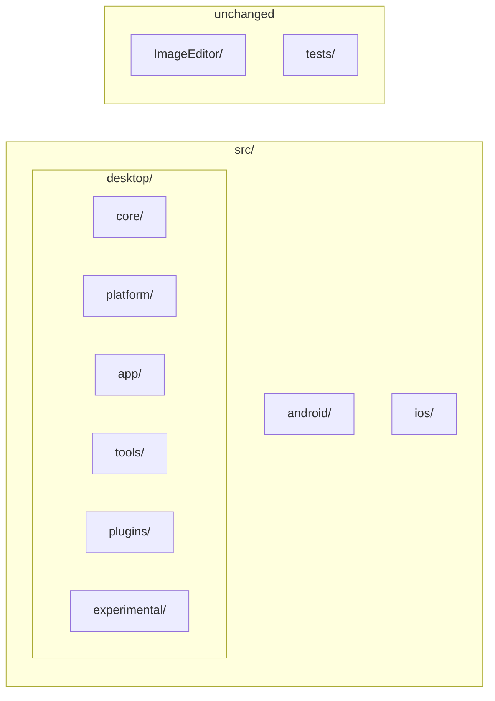

# XerahS repository file reorganisation plan

## Current state

- **Root**: [XerahS.sln](XerahS.sln), [Directory.Build.props](Directory.Build.props), [ImageEditor/](ImageEditor/) (own solution, submodule), [tests/](tests/), docs/, .github/, .ai/, .githooks/, etc.
- **src/** (flat): ~28 C# projects plus:
  - [src/Plugins/](src/Plugins/) with 5 plugins in **ShareX.*** folders but **XerahS.*** .csproj names
  - [src/XerahS.Mobile.Kt/](src/XerahS.Mobile.Kt/) (Kotlin/Gradle; not in .sln)
- **ImageEditor**: At root; githooks and [.github/workflows/imageeditor-submodule-enforce.yml](.github/workflows/imageeditor-submodule-enforce.yml) assume `ImageEditor/`; **do not move**.
- **tests/**: [tests/XerahS.Tests/](tests/XerahS.Tests/), [tests/ShareX.Avalonia.Tests/](tests/ShareX.Avalonia.Tests/) (naming inconsistency).

Project references use relative paths (e.g. `..\XerahS.Core\`, `..\Plugins\ShareX.AmazonS3.Plugin\`, `..\..\ImageEditor\src\ShareX.ImageEditor\`). Any move under `src/` will require updating those paths in every referring .csproj and in the solution file.

---

## Recommended structure (under `src/` only)

Organise by **what works together**: the .NET solution lives under **src/desktop/**; native mobile is separate under **src/android/** and **src/ios/**. ImageEditor and `tests/` stay at repo root.

**Desktop stack (works together)** — all under `src/desktop/`:

| Folder under `src/desktop/` | Projects to move here |
| --------------------------- | --------------------- |
| **core/**                   | XerahS.Core, XerahS.Common, XerahS.Services.Abstractions, XerahS.Services, XerahS.ViewModels, XerahS.History, XerahS.Indexer, XerahS.Uploaders, XerahS.Media |
| **platform/**               | XerahS.Platform.Abstractions, XerahS.Platform.Windows, XerahS.Platform.Linux, XerahS.Platform.MacOS, XerahS.Platform.Mobile |
| **app/**                    | XerahS.App, XerahS.UI, XerahS.Bootstrap, XerahS.RegionCapture (the desktop application — **not** src/desktop/desktop/) |
| **tools/**                  | XerahS.CLI, XerahS.WatchFolder.Daemon, XerahS.PluginExporter, XerahS.Audits.Tool |
| **plugins/**                | Current Plugins contents; optionally rename ShareX.* → XerahS.* to match .csproj |
| **experimental/**           | XerahS.Mobile.Core, XerahS.Mobile.Ava, XerahS.Mobile.Maui, XerahS.Mobile.iOS.ShareExtension |

**Native mobile (separate stack)** — top-level under `src/`:

| Folder under `src/` | Contents |
| ------------------- | -------- |
| **android/**        | Kotlin app (current **XerahS.Mobile.Kt** tree; folder name **android**, not XerahS.Mobile.Kt) |
| **ios/**            | Swift app (current **XerahS.Mobile.Swift**; folder name **ios**, not XerahS.Mobile.Swift) |

After moves, paths look like:

- `src/desktop/core/XerahS.Core/XerahS.Core.csproj`
- `src/desktop/app/XerahS.App/XerahS.App.csproj`
- `src/desktop/experimental/XerahS.Mobile.Ava/XerahS.Mobile.Ava.csproj`
- `src/desktop/plugins/XerahS.Imgur.Plugin/...` (if plugin folders renamed)
- `src/android/` — Kotlin app (app/, core/, feature/, build.gradle.kts, etc.)
- `src/ios/` — Swift app

---

## Execution order (mechanical only)

Each step is numbered so you can say e.g. "skip step 5" or "tweak step 3".

**1.** **Create directories**
  `src/desktop/`, `src/desktop/core/`, `src/desktop/platform/`, `src/desktop/app/`, `src/desktop/tools/`, `src/desktop/plugins/`, `src/desktop/experimental/`, `src/android/`, `src/ios/`.

**2.** **Move Core projects** — `git mv` into `src/desktop/core/`: XerahS.Core, XerahS.Common, XerahS.Services.Abstractions, XerahS.Services, XerahS.ViewModels, XerahS.History, XerahS.Indexer, XerahS.Uploaders, XerahS.Media.

**3.** **Move Platform projects** — `git mv` into `src/desktop/platform/`: XerahS.Platform.Abstractions, XerahS.Platform.Windows, XerahS.Platform.Linux, XerahS.Platform.MacOS, XerahS.Platform.Mobile.

**4.** **Move desktop app** — `git mv` into `src/desktop/app/`: XerahS.App, XerahS.UI, XerahS.Bootstrap, XerahS.RegionCapture (the application; **not** a folder named desktop).

**5.** **Move Kotlin app** — `git mv src/XerahS.Mobile.Kt src/android` (folder name **android**, not XerahS.Mobile.Kt).

**6.** **Move Swift app** — `git mv src/XerahS.Mobile.Swift src/ios` (folder name **ios**, not XerahS.Mobile.Swift).

**7.** **Move experimental mobile** — `git mv` into `src/desktop/experimental/`: XerahS.Mobile.Core, XerahS.Mobile.Ava, XerahS.Mobile.Maui, XerahS.Mobile.iOS.ShareExtension.

**8.** **Move Tools projects** — `git mv` into `src/desktop/tools/`: XerahS.CLI, XerahS.WatchFolder.Daemon, XerahS.PluginExporter, XerahS.Audits.Tool.

**9.** **Move Plugins** — Move entire `src/Plugins/` contents into `src/desktop/plugins/` (or `git mv src/Plugins src/desktop/plugins` if you replace the folder). Optionally rename plugin subfolders ShareX.* → XerahS.*; then update solution and ProjectReferences (steps 10 and 11).

**10.** **Update [XerahS.sln](XerahS.sln)**
  Change every `Project(...)` path from `src\...` to `src\desktop\core\...`, `src\desktop\app\...`, etc. ImageEditor and tests paths stay the same. Kotlin app is under `src\android\` (not in .sln); Swift under `src\ios\` if in solution. Solution folder nesting can mirror desktop (core, platform, app, tools, plugins, experimental).

**11.** **Update all .csproj `ProjectReference` paths**
  Each reference must reflect the new relative path. All .NET projects are under `src/desktop/`; path depth depends on referrer. Examples:
  - From `src/desktop/app/XerahS.App/`: `..\..\core\XerahS.Core\`, `..\..\platform\XerahS.Platform.Windows\`, `..\..\tools\XerahS.WatchFolder.Daemon\`
  - From `src/desktop/app/XerahS.UI/`: ImageEditor = `..\..\..\..\ImageEditor\src\ShareX.ImageEditor\ShareX.ImageEditor.csproj` (four levels up to repo root)
  - From `src/desktop/experimental/`: `..\core\XerahS.Core\`, `..\plugins\XerahS.AmazonS3.Plugin\` etc.

**12.** **Update Directory.Build.props under plugins (if needed)**
  If [src/Plugins/](src/Plugins/) had a Directory.Build.props, move or recreate it under `src/desktop/plugins/` as needed.

**13.** **Optional: rename plugin subfolders** — Under `src/desktop/plugins/`, rename ShareX.* → XerahS.*. Then update solution and all ProjectReferences that point to Plugins.

**14.** **Update build-windows-exe SKILL.md** — Update hardcoded paths to `src\desktop\...`; ImageEditor paths unchanged.

**15.** **Update build-android SKILL.md** — Update paths to `src\android\` for Kotlin app; `src\desktop\experimental\...` if MAUI/Avalonia mobile referenced; plugin paths if step 13 done.

**16.** **Update build-linux-binary SKILL.md** — Update any `src/` paths to `src/desktop/...` or `src/android/`, `src/ios/`.

**17.** **Update other scripts/docs** — Search `.githooks/`, `scripts/`, docs for old `src\XerahS.*` or `src\Plugins` paths and fix to `src\desktop\...`, `src\android\`, `src\ios\`.

**18.** **Optional: rename test folder** — `tests/ShareX.Avalonia.Tests` → `tests/XerahS.Avalonia.Tests` and update solution + references.

**19.** **Verify** — Run `dotnet build XerahS.sln` from repo root (0 errors); build Android/iOS if in use.

---

## What not to change

- **ImageEditor/**  
Leave at repo root. Submodule and workflows assume `ImageEditor/`.
- **Solution and project file content**  
Only path strings in .sln and ProjectReference Include; no code or TFMs.
- **Kotlin and Swift (folder names)**  
Move Kotlin app to **src/android/** (folder name **android**, not XerahS.Mobile.Kt). Move Swift app to **src/ios/** (folder name **ios**, not XerahS.Mobile.Swift). Gradle/settings.gradle.kts are self-contained; no path changes inside the Kotlin project. Update any docs/scripts that reference `XerahS.Mobile.Kt` or `XerahS.Mobile.Swift` to `src/android` and `src/ios`.
- **No src/desktop/desktop/**  
The desktop application lives in **src/desktop/app/** (App, UI, Bootstrap, RegionCapture), not in a subfolder named `desktop`.

---

## Risk and scope

- **Scope**: All .NET projects move under `src/desktop/` (one extra path segment); many .csproj ProjectReferences and the .sln must be updated; .ai/skills and docs that hardcode paths must be updated. Android and iOS move to `src/android/` and `src/ios/`.
- **Risk**: Missing a ProjectReference or solution path causes build failure; do a full `dotnet build` and fix any broken references. Prefer a single commit (or a short series) so you can revert easily.
- **Plugin folder renames**: Optional (step 13). If you rename ShareX.* → XerahS.* under `src/desktop/plugins/`, update every ProjectReference that points to Plugins and the solution.

---

## Alternative: minimal reorganisation

If you prefer minimal change:

- **Only** add `src/android/` and `src/ios/` (move Kotlin and Swift there); optionally add `src/desktop/experimental/` and move the four experimental mobile projects. Leave Core, Platform, App, Tools, Plugins **flat** under `src/` (no `src/desktop/`).
- Or **only rename** plugin directories ShareX.* → XerahS.* and optionally the test folder; no moves.

That reduces the scope and rebase impact on open PRs.
