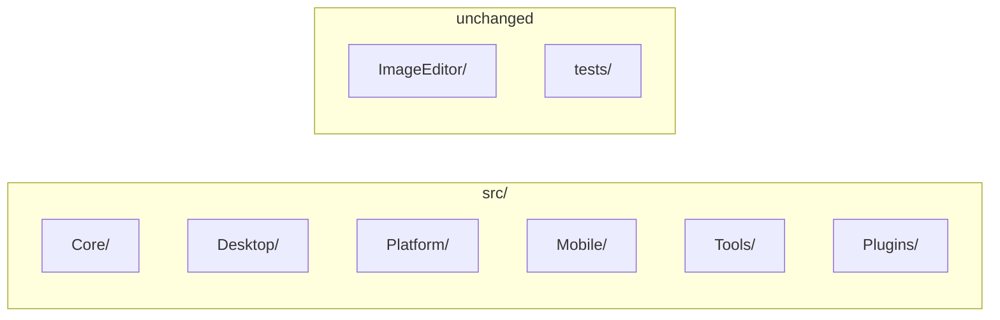

# XerahS repository file reorganisation plan

## Current state

- **Root**: [XerahS.sln](XerahS.sln), [Directory.Build.props](Directory.Build.props), [ImageEditor/](ImageEditor/) (own solution, submodule), [tests/](tests/), docs/, .github/, .ai/, .githooks/, etc.
- **src/** (flat): ~28 C# projects plus:
  - [src/Plugins/](src/Plugins/) with 5 plugins in **ShareX.*** folders but **XerahS.*** .csproj names
  - [src/XerahS.Mobile.Kt/](src/XerahS.Mobile.Kt/) (Kotlin/Gradle; not in .sln)
- **ImageEditor**: At root; githooks and [.github/workflows/imageeditor-submodule-enforce.yml](.github/workflows/imageeditor-submodule-enforce.yml) assume `ImageEditor/`; **do not move**.
- **tests/**: [tests/XerahS.Tests/](tests/XerahS.Tests/), [tests/ShareX.Avalonia.Tests/](tests/ShareX.Avalonia.Tests/) (naming inconsistency).

Project references use relative paths (e.g. `..\XerahS.Core\`, `..\Plugins\ShareX.AmazonS3.Plugin\`, `..\..\ImageEditor\src\ShareX.ImageEditor\`). Any move under `src/` will require updating those paths in every referring .csproj and in the solution file.

---

## Recommended structure (under `src/` only)

Keep a single `src/` root and introduce **domain subfolders** so new projects have a clear place. ImageEditor and `tests/` stay where they are.

| New folder under `src/` | Projects to move here                                                                                                                                        |
| ----------------------- | ------------------------------------------------------------------------------------------------------------------------------------------------------------ |
| **src/Core/**           | XerahS.Core, XerahS.Common, XerahS.Services.Abstractions, XerahS.Services, XerahS.ViewModels, XerahS.History, XerahS.Indexer, XerahS.Uploaders, XerahS.Media |
| **src/Desktop/**        | XerahS.App, XerahS.UI, XerahS.Bootstrap, XerahS.RegionCapture                                                                                                |
| **src/Platform/**       | XerahS.Platform.Abstractions, XerahS.Platform.Windows, XerahS.Platform.Linux, XerahS.Platform.MacOS, XerahS.Platform.Mobile                                  |
| **src/Mobile/**         | XerahS.Mobile.Core, XerahS.Mobile.Ava, XerahS.Mobile.Maui, XerahS.Mobile.iOS.ShareExtension, XerahS.Mobile.Kt, XerahS.Mobile.Swift (README)                  |
| **src/Tools/**          | XerahS.CLI, XerahS.WatchFolder.Daemon, XerahS.PluginExporter, XerahS.Audits.Tool                                                                             |
| **src/Plugins/**        | Keep as is; optionally rename subfolders ShareX.* → XerahS.* (e.g. ShareX.Imgur.Plugin → XerahS.Imgur.Plugin) to match .csproj                               |

After moves, paths look like:

- `src/Core/XerahS.Core/XerahS.Core.csproj`
- `src/Mobile/XerahS.Mobile.Ava/XerahS.Mobile.Ava.csproj`
- `src/Plugins/XerahS.Imgur.Plugin/XerahS.Imgur.Plugin.csproj` (if plugin folders renamed)

---

## Execution order (mechanical only)

Each step is numbered so you can say e.g. "skip step 5" or "tweak step 3".

**1.** **Create directories**
  `src/Core`, `src/Desktop`, `src/Platform`, `src/Mobile`, `src/Tools`. Leave `src/Plugins` as is (only rename children if desired).
**2.** **Move Core projects** — `git mv` into `src/Core/`: XerahS.Core, XerahS.Common, XerahS.Services.Abstractions, XerahS.Services, XerahS.ViewModels, XerahS.History, XerahS.Indexer, XerahS.Uploaders, XerahS.Media.

**3.** **Move Desktop projects** — `git mv` into `src/Desktop/`: XerahS.App, XerahS.UI, XerahS.Bootstrap, XerahS.RegionCapture.

**4.** **Move Platform projects** — `git mv` into `src/Platform/`: XerahS.Platform.Abstractions, XerahS.Platform.Windows, XerahS.Platform.Linux, XerahS.Platform.MacOS, XerahS.Platform.Mobile.

**5.** **Move Mobile projects** — `git mv` into `src/Mobile/`: XerahS.Mobile.Core, XerahS.Mobile.Ava, XerahS.Mobile.Maui, XerahS.Mobile.iOS.ShareExtension, XerahS.Mobile.Kt, XerahS.Mobile.Swift (README).

**6.** **Move Tools projects** — `git mv` into `src/Tools/`: XerahS.CLI, XerahS.WatchFolder.Daemon, XerahS.PluginExporter, XerahS.Audits.Tool.

**7.** **Update [XerahS.sln](XerahS.sln)**
  Change every `Project(...)` path from `src\XerahS.*\` to the new path (e.g. `src\Core\XerahS.Core\`, `src\Mobile\XerahS.Mobile.Ava\`). ImageEditor and tests paths stay the same. Solution folder nesting (e.g. "Plugins") can be updated to match (e.g. "Core", "Desktop", "Mobile", "Platform", "Tools").
**8.** **Update all .csproj `ProjectReference` paths**
  Each reference must reflect the new relative path from the referring project to the referenced project. Examples:

- From `src/Desktop/XerahS.App/`: `..\Core\XerahS.Core\`, `..\..\Platform\XerahS.Platform.Windows\`, `..\..\Tools\XerahS.WatchFolder.Daemon\`
- From `src/UI/` (if under Desktop): one more `..` as needed
- ImageEditor reference (from UI): remains `..\..\..\ImageEditor\src\ShareX.ImageEditor\ShareX.ImageEditor.csproj` when UI is under `src/Desktop/` (three levels up to root)
- Plugins: if plugin folders are renamed, references like `..\Plugins\ShareX.AmazonS3.Plugin\` become `..\..\Plugins\XerahS.AmazonS3.Plugin\` from Mobile projects (and path depth depends on referrer).

**9.** **Update [src/Plugins/Directory.Build.props](src/Plugins/Directory.Build.props) (if needed)**
  Only if you add a Directory.Build.props under another new folder; root [Directory.Build.props](Directory.Build.props) does not reference project paths.
**10.** **Optional: rename plugin subfolders** — Under `src/Plugins/`, rename ShareX.* → XerahS.* (Imgur, AmazonS3, Paste2, GitHubGist, Auto). Then update solution and ProjectReferences (steps 7 and 8) if done.

**11.** **Update build-windows-exe SKILL.md** — Update hardcoded paths; ImageEditor paths unchanged.

**12.** **Update build-android SKILL.md** — Update paths (e.g. `src\Mobile\XerahS.Mobile.Ava\`, plugin paths if step 10 done).

**13.** **Update build-linux-binary SKILL.md** — Update any `src/` or plugin paths that changed.

**14.** **Update other scripts/docs** — Search `.githooks/`, `scripts/`, docs for moved paths and fix.

**15.** **Optional: rename test folder** — `tests/ShareX.Avalonia.Tests` → `tests/XerahS.Avalonia.Tests` and update solution + references.

**16.** **Verify** — Run `dotnet build XerahS.sln` from repo root (0 errors); build mobile projects if in use.

---

## What not to change

- **ImageEditor/**  
Leave at repo root. Submodule and workflows assume `ImageEditor/`.
- **Solution and project file content**  
Only path strings in .sln and ProjectReference Include; no code or TFMs.
- **XerahS.Mobile.Kt**  
Move it under `src/Mobile/XerahS.Mobile.Kt`; Gradle and settings.gradle.kts are self-contained under that folder, so no path changes inside Kotlin projects if the whole folder is moved.

---

## Risk and scope

- **Scope**: Many .csproj files (every project that references another) and the single .sln; a handful of .ai/skills and docs.
- **Risk**: Missing a ProjectReference or solution path causes build failure; do a full `dotnet build` and fix any broken references. Prefer a single commit (or a short series) so you can revert easily.
- **Plugin folder renames**: Optional. If you rename `ShareX.`* → `XerahS.`*, update every ProjectReference that points into Plugins (e.g. Mobile.Ava, Mobile.Maui, UI/App if any) and solution paths.

---

## Alternative: minimal reorganisation

If you prefer minimal change and only want consistency:

- **Only rename** plugin directories under `src/Plugins/` from `ShareX.`* to `XerahS.`*, and optionally `tests/ShareX.Avalonia.Tests` to `tests/XerahS.Avalonia.Tests`.
- Update [XerahS.sln](XerahS.sln) and all `ProjectReference` paths that point to those folders.
- No new subfolders under `src/`.

This avoids the large reshuffle but still aligns folder names with project names and reduces confusion for new projects.
