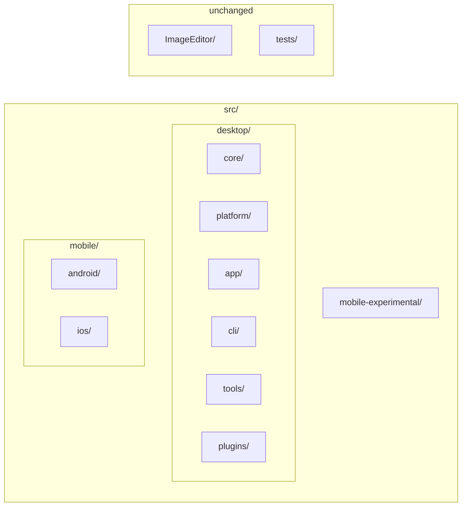

# XerahS repository file reorganisation plan

## Current state

- **Root**: [XerahS.sln](XerahS.sln), [Directory.Build.props](Directory.Build.props), [ImageEditor/](ImageEditor/) (own solution, submodule), [tests/](tests/), docs/, .github/, .ai/, .githooks/, etc.
- **src/** (flat): ~28 C# projects plus:
  - [src/Plugins/](src/Plugins/) with 5 plugins in **ShareX.*** folders but **XerahS.*** .csproj names
  - [src/XerahS.Mobile.Kt/](src/XerahS.Mobile.Kt/) (Kotlin/Gradle; not in .sln)
- **ImageEditor**: At root; githooks and [.github/workflows/imageeditor-submodule-enforce.yml](.github/workflows/imageeditor-submodule-enforce.yml) assume `ImageEditor/`; **do not move**.
- **tests/**: [tests/XerahS.Tests/](tests/XerahS.Tests/), [tests/ShareX.Avalonia.Tests/](tests/ShareX.Avalonia.Tests/) (naming inconsistency).

Project references use relative paths (e.g. `..\XerahS.Core\`, `..\Plugins\ShareX.AmazonS3.Plugin\`, `..\..\ImageEditor\src\ShareX.ImageEditor\`). Any move under `src/` will require updating those paths in every referring .csproj and in the solution file.

---

## Recommended structure (under `src/` only)

Organise by **what works together**: the .NET solution lives under **src/desktop/**; native mobile under **src/mobile/** with **android/** and **ios/** so one folder (`src/mobile/`) gives context for both platforms (agentic-friendly). ImageEditor and `tests/` stay at repo root.



**Desktop stack (works together)** — all under `src/desktop/`:

| Folder under `src/desktop/` | Projects to move here |
| --------------------------- | --------------------- |
| **core/**                   | XerahS.Core, XerahS.Common, XerahS.Services.Abstractions, XerahS.Services, XerahS.ViewModels, XerahS.History, XerahS.Indexer, XerahS.Uploaders, XerahS.Media |
| **platform/**               | XerahS.Platform.Abstractions, XerahS.Platform.Windows, XerahS.Platform.Linux, XerahS.Platform.MacOS, XerahS.Platform.Mobile |
| **app/**                    | XerahS.App, XerahS.UI, XerahS.Bootstrap, XerahS.RegionCapture (the desktop application — **not** src/desktop/desktop/) |
| **cli/**                    | XerahS.CLI (product that shares core; sibling to app, not under tools) |
| **tools/**                  | XerahS.WatchFolder.Daemon, XerahS.PluginExporter, XerahS.Audits.Tool |
| **plugins/**                | Current Plugins contents; optionally rename ShareX.* → XerahS.* to match .csproj |

**Experimental .NET mobile** — under **src/mobile-experimental/** (sibling to desktop and mobile):

| Folder                      | Projects to move here |
| --------------------------- | --------------------- |
| **src/mobile-experimental/** | XerahS.Mobile.Core, XerahS.Mobile.Ava, XerahS.Mobile.Maui, XerahS.Mobile.iOS.ShareExtension |

**Native mobile (separate stack)** — under **src/mobile/** so one path gives context for both platforms:

| Folder under `src/mobile/` | Contents |
| -------------------------- | -------- |
| **android/**               | Kotlin app (current **XerahS.Mobile.Kt** tree; folder name **android**, not XerahS.Mobile.Kt) |
| **ios/**                   | Swift app (current **XerahS.Mobile.Swift**; folder name **ios**, not XerahS.Mobile.Swift) |

After moves, paths look like:

- `src/desktop/core/XerahS.Core/XerahS.Core.csproj`
- `src/desktop/app/XerahS.App/XerahS.App.csproj`
- `src/desktop/cli/XerahS.CLI/XerahS.CLI.csproj`
- `src/mobile-experimental/XerahS.Mobile.Ava/XerahS.Mobile.Ava.csproj`
- `src/desktop/plugins/XerahS.Imgur.Plugin/...` (if plugin folders renamed)
- `src/mobile/android/` — Kotlin app (app/, core/, feature/, build.gradle.kts, etc.)
- `src/mobile/ios/` — Swift app

### Target folder tree (after reorg)

Full folder structure at repo root and under `src/` so the layout is clear:

```
XerahS/
├── .ai/
├── .github/
├── .githooks/
├── .cursorrules
├── .gitignore
├── AGENTS.md
├── Directory.Build.props
├── README.md
├── XerahS.sln
├── ImageEditor/                    (unchanged; submodule)
│   ├── src/
│   │   ├── ShareX.ImageEditor/
│   │   └── ShareX.ImageEditor.Loader/
│   └── ShareX.ImageEditor.sln
├── docs/
├── developers/
├── scripts/
├── tasks/
├── tests/
│   ├── XerahS.Tests/
│   └── ShareX.Avalonia.Tests/      (optional: rename to XerahS.Avalonia.Tests)
│
└── src/
    ├── desktop/                    (.NET stack — works together)
    │   ├── core/
    │   │   ├── XerahS.Core/
    │   │   ├── XerahS.Common/
    │   │   ├── XerahS.Services.Abstractions/
    │   │   ├── XerahS.Services/
    │   │   ├── XerahS.ViewModels/
    │   │   ├── XerahS.History/
    │   │   ├── XerahS.Indexer/
    │   │   ├── XerahS.Uploaders/
    │   │   └── XerahS.Media/
    │   ├── platform/
    │   │   ├── XerahS.Platform.Abstractions/
    │   │   ├── XerahS.Platform.Windows/
    │   │   ├── XerahS.Platform.Linux/
    │   │   ├── XerahS.Platform.MacOS/
    │   │   └── XerahS.Platform.Mobile/
    │   ├── app/                     (desktop application — not desktop/desktop)
    │   │   ├── XerahS.App/
    │   │   ├── XerahS.UI/
    │   │   ├── XerahS.Bootstrap/
    │   │   └── XerahS.RegionCapture/
    │   ├── cli/                     (CLI product — shares core, sibling to app)
    │   │   └── XerahS.CLI/
    │   ├── tools/
    │   │   ├── XerahS.WatchFolder.Daemon/
    │   │   ├── XerahS.PluginExporter/
    │   │   └── XerahS.Audits.Tool/
    │   ├── plugins/
    │   │   ├── XerahS.Imgur.Plugin/         (or ShareX.Imgur.Plugin if not renamed)
    │   │   ├── XerahS.AmazonS3.Plugin/
    │   │   ├── XerahS.Paste2.Plugin/
    │   │   ├── XerahS.GitHubGist.Plugin/
    │       │   └── XerahS.Auto.Plugin/
    │
    ├── mobile-experimental/       (experimental .NET mobile — Ava, Maui, etc.)
    │   ├── XerahS.Mobile.Core/
    │   ├── XerahS.Mobile.Ava/
    │   ├── XerahS.Mobile.Maui/
    │   └── XerahS.Mobile.iOS.ShareExtension/
    │
    └── mobile/                    (native apps — one folder = both platforms)
        ├── android/                (Kotlin; ex XerahS.Mobile.Kt)
        │   ├── app/
        │   ├── core/
        │   │   ├── common/
        │   │   ├── data/
        │   │   └── domain/
        │   ├── feature/
        │   │   ├── upload/
        │   │   ├── history/
        │   │   └── settings/
        │   ├── build.gradle.kts
        │   └── settings.gradle.kts
        └── ios/                    (Swift; ex XerahS.Mobile.Swift)
            └── ...
```

---

## Execution order (mechanical only)

Each step is numbered so you can say e.g. "skip step 5" or "tweak step 3".

**1.** **Create directories**
  `src/desktop/`, `src/desktop/core/`, `src/desktop/platform/`, `src/desktop/app/`, `src/desktop/cli/`, `src/desktop/tools/`, `src/desktop/plugins/`, `src/mobile-experimental/`, `src/mobile/`, `src/mobile/android/`, `src/mobile/ios/`.

**2.** **Move Core projects** — `git mv` into `src/desktop/core/`: XerahS.Core, XerahS.Common, XerahS.Services.Abstractions, XerahS.Services, XerahS.ViewModels, XerahS.History, XerahS.Indexer, XerahS.Uploaders, XerahS.Media.

**3.** **Move Platform projects** — `git mv` into `src/desktop/platform/`: XerahS.Platform.Abstractions, XerahS.Platform.Windows, XerahS.Platform.Linux, XerahS.Platform.MacOS, XerahS.Platform.Mobile.

**4.** **Move desktop app** — `git mv` into `src/desktop/app/`: XerahS.App, XerahS.UI, XerahS.Bootstrap, XerahS.RegionCapture (the application; **not** a folder named desktop).

**5.** **Move CLI** — `git mv src/XerahS.CLI src/desktop/cli/XerahS.CLI` (CLI shares core; product under desktop, sibling to app).

**6.** **Move Kotlin app** — `git mv src/XerahS.Mobile.Kt src/mobile/android` (folder name **android**, not XerahS.Mobile.Kt).

**7.** **Move Swift app** — `git mv src/XerahS.Mobile.Swift src/mobile/ios` (folder name **ios**, not XerahS.Mobile.Swift).

**8.** **Move experimental mobile** — `git mv` into `src/mobile-experimental/`: XerahS.Mobile.Core, XerahS.Mobile.Ava, XerahS.Mobile.Maui, XerahS.Mobile.iOS.ShareExtension.

**9.** **Move Tools projects** — `git mv` into `src/desktop/tools/`: XerahS.WatchFolder.Daemon, XerahS.PluginExporter, XerahS.Audits.Tool (XerahS.CLI already moved to src/desktop/cli/ in step 5).

**10.** **Move Plugins** — Move entire `src/Plugins/` contents into `src/desktop/plugins/` (or `git mv src/Plugins src/desktop/plugins` if you replace the folder). Optionally rename plugin subfolders ShareX.* → XerahS.*; then update solution and ProjectReferences (steps 11 and 12).

**11.** **Update [XerahS.sln](XerahS.sln)**
  Change every `Project(...)` path from `src\...` to `src\desktop\core\...`, `src\desktop\app\...`, `src\desktop\cli\XerahS.CLI\...`, etc. ImageEditor and tests paths stay the same. Kotlin app is under `src\mobile\android\` (not in .sln); Swift under `src\mobile\ios\` if in solution. Solution folder nesting can mirror desktop (core, platform, app, cli, tools, plugins) and mobile-experimental.

**12.** **Update all .csproj `ProjectReference` paths**
  Each reference must reflect the new relative path. Path depth depends on referrer. Examples:
  - From `src/desktop/app/XerahS.App/`: `..\..\core\XerahS.Core\`, `..\..\platform\XerahS.Platform.Windows\`, `..\..\tools\XerahS.WatchFolder.Daemon\`
  - From `src/desktop/app/XerahS.UI/`: ImageEditor = `..\..\..\..\ImageEditor\src\ShareX.ImageEditor\ShareX.ImageEditor.csproj` (four levels up to repo root)
  - From `src/desktop/cli/XerahS.CLI/`: `..\..\core\XerahS.Core\`, `..\..\platform\XerahS.Platform.Windows\`, `..\..\app\XerahS.Bootstrap\` etc. (same level as app; one level up to desktop, then into core/platform/app).
  - From `src/mobile-experimental/`: `..\desktop\core\XerahS.Core\`, `..\desktop\plugins\XerahS.AmazonS3.Plugin\` etc. (one level up to src, then into desktop).

**13.** **Update Directory.Build.props under plugins (if needed)**
  If [src/Plugins/](src/Plugins/) had a Directory.Build.props, move or recreate it under `src/desktop/plugins/` as needed.

**14.** **Optional: rename plugin subfolders** — Under `src/desktop/plugins/`, rename ShareX.* → XerahS.*. Then update solution and all ProjectReferences that point to Plugins.

**15.** **Update build-windows-exe SKILL.md** — Update hardcoded paths to `src\desktop\...`; ImageEditor paths unchanged.

**16.** **Update build-android SKILL.md** — Update paths to `src\mobile\android\` for Kotlin app; `src\mobile-experimental\...` if MAUI/Avalonia mobile referenced; plugin paths if step 14 done.

**17.** **Update build-linux-binary SKILL.md** — Update any `src/` paths to `src/desktop/...`, `src/mobile-experimental/...`, `src/mobile/android/`, `src/mobile/ios/`.

**18.** **Update other scripts/docs** — Search `.githooks/`, `scripts/`, docs for old `src\XerahS.*` or `src\Plugins` paths and fix to `src\desktop\...`, `src\mobile-experimental\...`, `src\mobile\android\`, `src\mobile\ios\`.

**19.** **Optional: rename test folder** — `tests/ShareX.Avalonia.Tests` → `tests/XerahS.Avalonia.Tests` and update solution + references.

**20.** **Verify** — Run `dotnet build XerahS.sln` from repo root (0 errors); build Android/iOS if in use.

---


## What not to change

- **ImageEditor/**  
Leave at repo root. Submodule and workflows assume `ImageEditor/`.
- **Solution and project file content**  
Only path strings in .sln and ProjectReference Include; no code or TFMs.
- **Kotlin and Swift (folder names)**  
Move Kotlin app to **src/mobile/android/** (folder name **android**, not XerahS.Mobile.Kt). Move Swift app to **src/mobile/ios/** (folder name **ios**, not XerahS.Mobile.Swift). One parent **src/mobile/** gives context for both platforms (agentic-friendly). Gradle/settings.gradle.kts are self-contained; no path changes inside the Kotlin project. Update any docs/scripts that reference `XerahS.Mobile.Kt` or `XerahS.Mobile.Swift` to `src/mobile/android` and `src/mobile/ios`.
- **No src/desktop/desktop/**  
The desktop application lives in **src/desktop/app/** (App, UI, Bootstrap, RegionCapture), not in a subfolder named `desktop`.
- **CLI shares core**  
XerahS.CLI lives in **src/desktop/cli/** (product sibling to app, shares desktop core; not under tools).

---

## Risk and scope

- **Scope**: All .NET projects move under `src/desktop/` (one extra path segment); many .csproj ProjectReferences and the .sln must be updated; .ai/skills and docs that hardcode paths must be updated. Experimental .NET mobile moves to `src/mobile-experimental/`; Android and iOS to `src/mobile/android/` and `src/mobile/ios/`.
- **Risk**: Missing a ProjectReference or solution path causes build failure; do a full `dotnet build` and fix any broken references. Prefer a single commit (or a short series) so you can revert easily.
- **Plugin folder renames**: Optional (step 13). If you rename ShareX.* → XerahS.* under `src/desktop/plugins/`, update every ProjectReference that points to Plugins and the solution.

---

## Alternative: minimal reorganisation

If you prefer minimal change:

- **Only** add `src/mobile/android/` and `src/mobile/ios/` (move Kotlin and Swift there); optionally add `src/mobile-experimental/` and move the four experimental mobile projects. Leave Core, Platform, App, Tools, Plugins **flat** under `src/` (no `src/desktop/`).
- Or **only rename** plugin directories ShareX.* → XerahS.* and optionally the test folder; no moves.

That reduces the scope and rebase impact on open PRs.
