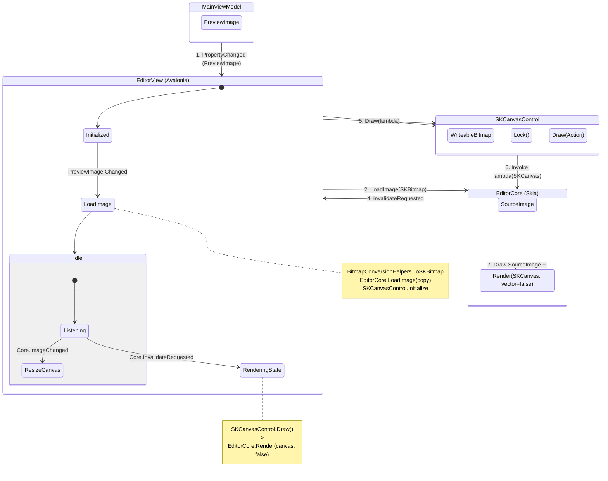

```xml
<task>
  Implement the Hybrid Rendering Architecture for ShareX.Editor as defined in the technical usage report to maximize performance and responsiveness.
</task>

<context>
  <background>
    The current ShareX.Editor uses a mix of Avalonia controls and SkiaSharp logic often triggering expensive bitmap conversions.
    A technical review (docs/technical/skia_vs_avalonia_usage_report.md) recommends a Hybrid Model:
    1. SkiaSharp for high-performance pixel rendering (Background Layer).
    2. Avalonia for vector overlays and interaction (Foreground Layer).
  </background>
  <problem>
    Current image manipulations (crop, blur, filters) and zooming/panning on large images can be sluggish due to full re-rendering and bitmap marshalling.
  </problem>
  <goal>
    Achieve zero-copy rendering for the main image surface and sub-millisecond responsiveness for UI interactions.
  </goal>
</context>

<constraints>
  <must_not>
    <constraint>Do not remove Avalonia vector controls for annotations (Rectangles, Arrows, Text) as they provide necessary hit-testing and accessibility.</constraint>
    <constraint>Do not use GetPixel/SetPixel for any image manipulation.</constraint>
    <constraint>Do not introduce threading issues by accessing Avalonia UI objects from background threads.</constraint>
  </must_not>
  <must>
    <constraint>Use SKCanvas or WriteableBitmap.Lock() for direct pixel access.</constraint>
    <constraint>Ensure the EditorCore remains the single source of truth for the SKBitmap.</constraint>
    <constraint>Maintain existing feature parity (all tools must still work).</constraint>
  </must>
</constraints>

<steps>
  <step>
    <id>1</id>
    <action>Create a specialized `SKCanvasControl` (or utilize `Avalonia.Skia`) to serve as the high-performance background layer replacing the standard `PreviewImageControl`.</action>
  </step>
  <step>
    <id>2</id>
    <action>Refactor `EditorView` to layer the `AnnotationCanvas` (Avalonia) transparently on top of the new `SKCanvasControl`.</action>
  </step>
  <step>
    <id>3</id>
    <action>Update `EditorCore` to expose a render method that draws directly into the `SKCanvasControl`'s surface (using `WriteableBitmap` locking if needed) to eliminate bitmap copying.</action>
  </step>
  <step>
    <id>4</id>
    <action>Refactor complex image operations (Blur, Pixelate, Crop) in `EditorCore` to use `SKCanvas` commands exclusively.</action>
  </step>
  <step>
    <id>5</id>
    <action>Implement "Lazy Rendering" for effect previews: Render downsampled previews during slider interaction and commit full-quality rendering only on pointer release.</action>
  </step>
</steps>

<validation_rules>
  <rule>Main image rendering must occur without instantiating new `Bitmap` objects per frame.</rule>
  <rule>Dragging annotations must remain at 60fps+ even over 4K images.</rule>
  <rule>Applying a blur filter must show an immediate preview (potentially lower res) and settle to high quality instantly upon release.</rule>
  <rule>Memory usage should not spike during zoom/pan operations.</rule>
</validation_rules>

<output_format>
  <section>Implementation Status</section>
  <section>Changed Files</section>
  <section>Verification Results</section>
</output_format>
```

## Component Wiring Diagram


